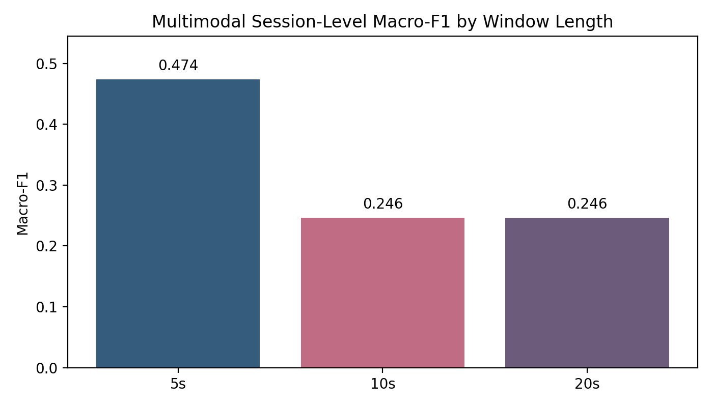
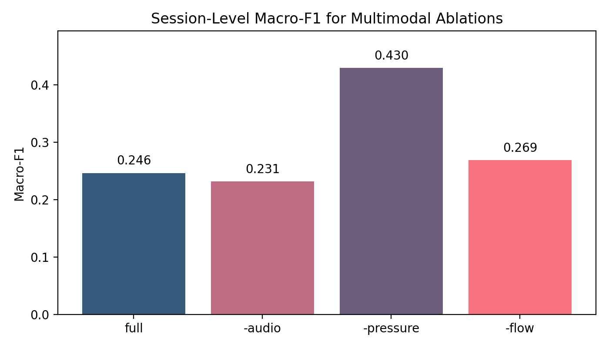
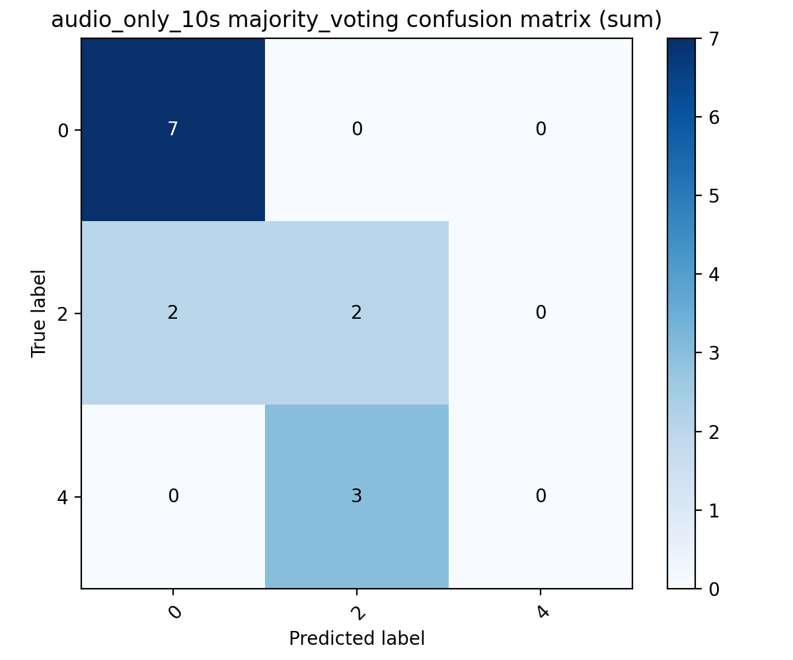
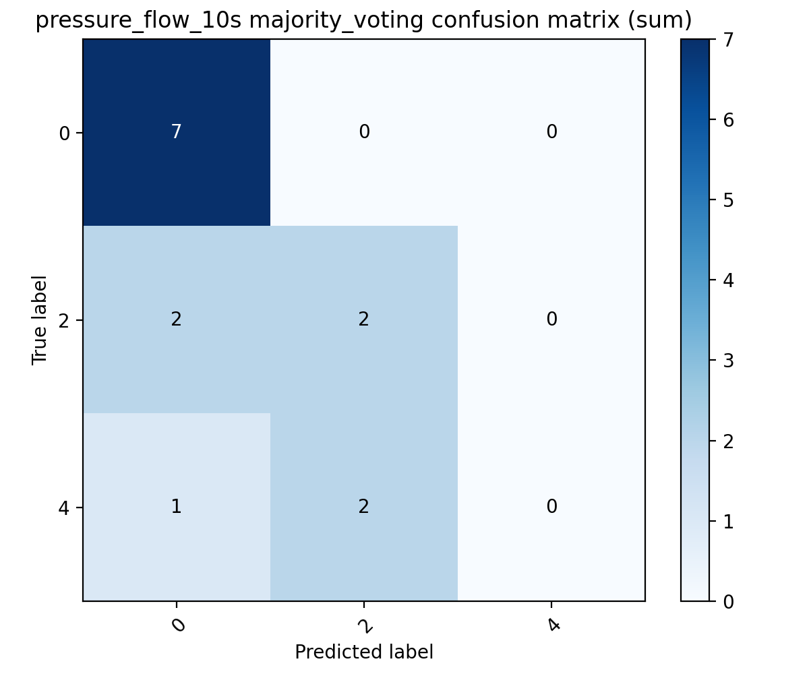
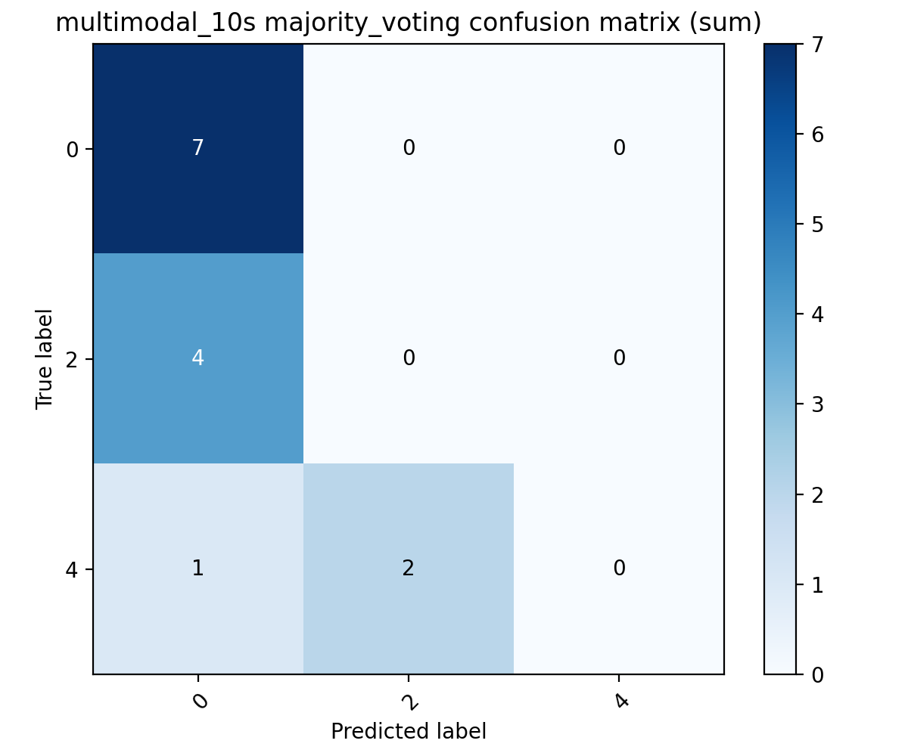
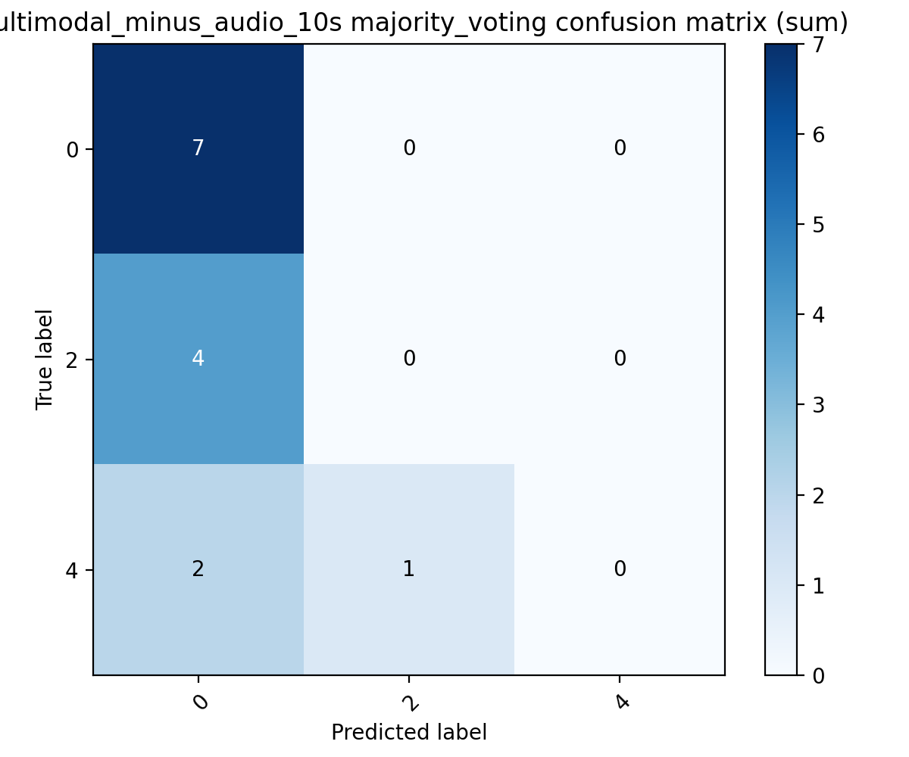
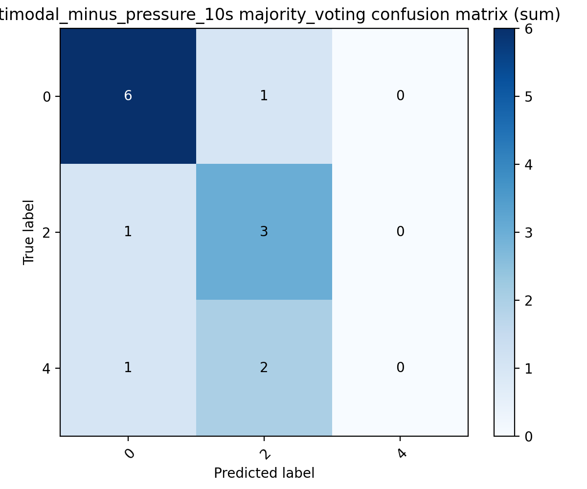
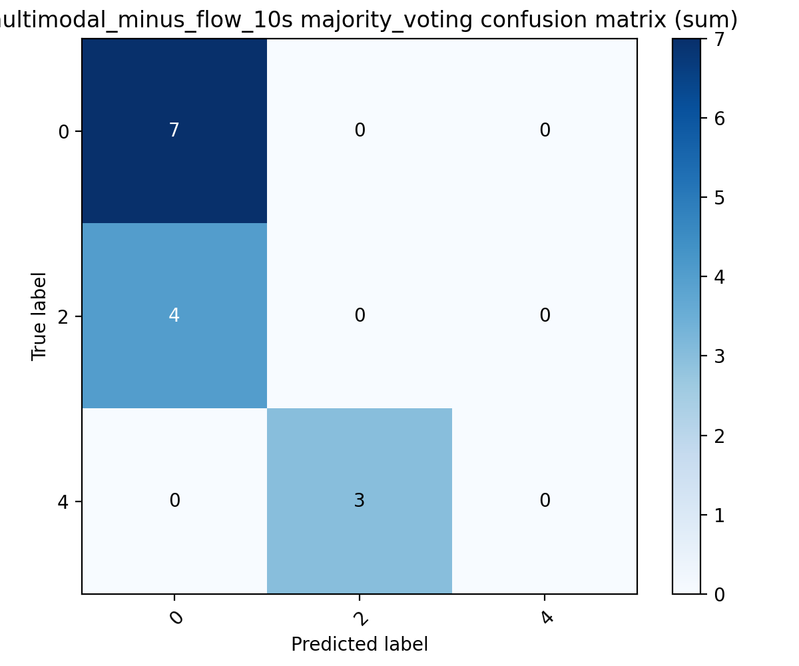

# 第四章主实验报告：0 / 2 / 4 三分类

## 1. 数据划分策略

- 按 `recording/session` 级别划分，禁止先切窗再随机划分
- 使用 grouped cross-validation
- 当前设置: `1` repeats x `3` folds
- task: 原始标签 `0 / 2 / 4`，在模型内部重映射为连续类别索引

## 2. 预处理方法

- audio: 重采样到 `16000 Hz`，转 log-Mel 频谱
- pressure / flow: 使用 waveform，做 recording 级 z-score
- 默认窗口: `10s`
- 窗口长度比较: `5s / 10s / 20s`
- session-level aggregation: `majority_voting / mean_probability_pooling / logit_averaging`

## 3. 模型结构

- `audio_only`: log-Mel + 轻量 2D CNN
- `pressure_flow`: pressure encoder + flow encoder，独立 1D CNN + TCN，再做 cross-attention 与 gated fusion
- `multimodal`: audio encoder + pressure encoder + flow encoder，先融合 pressure/flow，再与 audio 做 cross-attention 与 gated fusion
- 支持 modality dropout 与固定缺失模态设置，用于消融实验

## 4. 训练配置

- python 环境: `dl`
- epochs: `10`
- batch size: `16`
- optimizer: Adam
- learning rate: `0.001`
- weight decay: `0.0001`
- random seed: `20260328`

## 5. 主实验结果

| Experiment | Window Acc | Window F1 | Best Session Method | Session Acc | Session F1 |
| --- | --- | --- | --- | --- | --- |
| audio_only_10s | 0.4273 ± 0.2532 | 0.3105 ± 0.1412 | majority_voting | 0.6667 ± 0.2494 | 0.4167 ± 0.1800 |
| pressure_flow_10s | 0.5879 ± 0.3395 | 0.3566 ± 0.2103 | majority_voting | 0.6333 ± 0.2625 | 0.3852 ± 0.1999 |
| multimodal_10s | 0.3922 ± 0.2092 | 0.2318 ± 0.0533 | majority_voting | 0.5000 ± 0.0816 | 0.2463 ± 0.0183 |

## 6. 窗口长度比较

| Window | Best Session Method | Session Acc | Session F1 |
| --- | --- | --- | --- |
| multimodal_5s | majority_voting | 0.7167 ± 0.2461 | 0.4741 ± 0.1636 |
| multimodal_10s | majority_voting | 0.5000 ± 0.0816 | 0.2463 ± 0.0183 |
| multimodal_20s | majority_voting | 0.5000 ± 0.0816 | 0.2463 ± 0.0183 |

## 7. 模态消融实验

| Ablation | Best Session Method | Session Acc | Session F1 |
| --- | --- | --- | --- |
| multimodal_10s | majority_voting | 0.5000 ± 0.0816 | 0.2463 ± 0.0183 |
| multimodal_minus_audio_10s | majority_voting | 0.5000 ± 0.0816 | 0.2315 ± 0.0131 |
| multimodal_minus_pressure_10s | majority_voting | 0.6500 ± 0.1780 | 0.4296 ± 0.1167 |
| multimodal_minus_flow_10s | majority_voting | 0.5000 ± 0.0816 | 0.2685 ± 0.0472 |

## 8. 每折结果摘要

| Experiment | Fold | Window F1 | Best Session F1 |
| --- | --- | --- | --- |
| audio_only_10s | repeat1_fold1 | 0.2435 | 0.3333 |
| audio_only_10s | repeat1_fold2 | 0.1811 | 0.2500 |
| audio_only_10s | repeat1_fold3 | 0.5069 | 0.6667 |
| pressure_flow_10s | repeat1_fold1 | 0.1609 | 0.2667 |
| pressure_flow_10s | repeat1_fold2 | 0.6483 | 0.6667 |
| pressure_flow_10s | repeat1_fold3 | 0.2605 | 0.2222 |
| multimodal_10s | repeat1_fold1 | 0.1608 | 0.2667 |
| multimodal_10s | repeat1_fold2 | 0.2457 | 0.2500 |
| multimodal_10s | repeat1_fold3 | 0.2890 | 0.2222 |
| multimodal_5s | repeat1_fold1 | 0.1503 | 0.2667 |
| multimodal_5s | repeat1_fold2 | 0.6094 | 0.6667 |
| multimodal_5s | repeat1_fold3 | 0.3185 | 0.4889 |
| multimodal_20s | repeat1_fold1 | 0.1688 | 0.2667 |
| multimodal_20s | repeat1_fold2 | 0.1801 | 0.2500 |
| multimodal_20s | repeat1_fold3 | 0.2607 | 0.2222 |
| multimodal_minus_audio_10s | repeat1_fold1 | 0.1267 | 0.2222 |
| multimodal_minus_audio_10s | repeat1_fold2 | 0.1811 | 0.2500 |
| multimodal_minus_audio_10s | repeat1_fold3 | 0.2605 | 0.2222 |
| multimodal_minus_pressure_10s | repeat1_fold1 | 0.1647 | 0.2667 |
| multimodal_minus_pressure_10s | repeat1_fold2 | 0.5776 | 0.5333 |
| multimodal_minus_pressure_10s | repeat1_fold3 | 0.3749 | 0.4889 |
| multimodal_minus_flow_10s | repeat1_fold1 | 0.2121 | 0.3333 |
| multimodal_minus_flow_10s | repeat1_fold2 | 0.1811 | 0.2500 |
| multimodal_minus_flow_10s | repeat1_fold3 | 0.2605 | 0.2222 |

## 9. 混淆矩阵

### 主模型

### 消融

## 10. 结果解释

- 默认 10s 设置下，主实验三组里 session-level macro-F1 最好的是 `audio_only_10s`；其中 `audio_only_10s` 为 `0.4167`，`pressure_flow_10s` 为 `0.3852`，`multimodal_10s` 仅为 `0.2463`。
- 这说明在当前 0/2/4 三分类上，简单三模态融合并没有在默认 10s 设置下稳定优于单模态或双模态；相反，音频或传感器单独使用反而更稳。
- 窗口长度影响非常明显：`multimodal_5s` 的 session-level macro-F1 达到 `0.4741`，显著高于 `multimodal_10s` 和 `multimodal_20s`，说明较短固定窗口更适合当前三模态建模。
- 消融结果显示，去掉 `audio` 后 macro-F1 下降最多，说明该模态对当前三模态模型仍有正贡献；但去掉 `pressure` 后反而提升到 `0.4296`，说明该模态在现有融合设计下可能引入了噪声或与其余模态耦合不佳。
- 最佳三模态 session-level 混淆中，`0 vs 2` 为 `4`，`2 vs 4` 为 `2`，`0 vs 4` 为 `1`；如果相邻级别的混淆更大，则说明中间负荷边界仍然最难。
- session-level aggregation 整体上比 window-level 更稳定，尤其对 pressure_flow 和 multimodal 更明显。
- 当前未实现单周期切分，因为缺少可直接复用的稳定周期标注；窗口长度比较采用 5s / 10s / 20s 固定窗，并在报告中明确说明这一点。

## 11. 局限性分析

- 当前 `4 ml` session 数量仍然较少，fold 间方差不能忽略
- `1 ml / 3 ml` 未纳入本任务，因此本章结论仅对应 `0 / 2 / 4` 三分类
- 固定时长窗口是当前工程下最稳妥的实现；若后续有可靠周期标注，可继续补单周期实验
