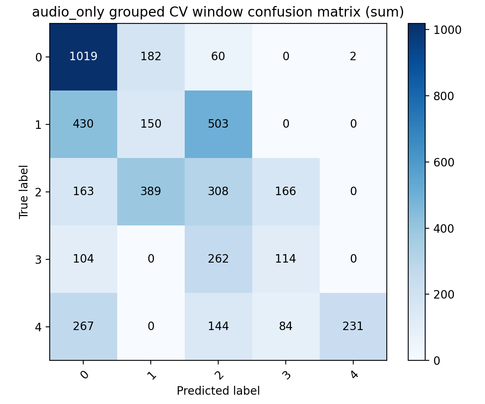
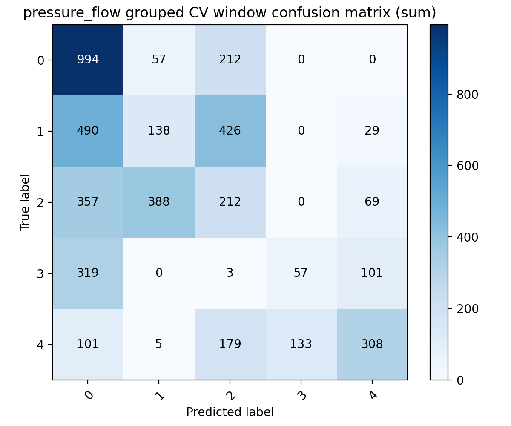
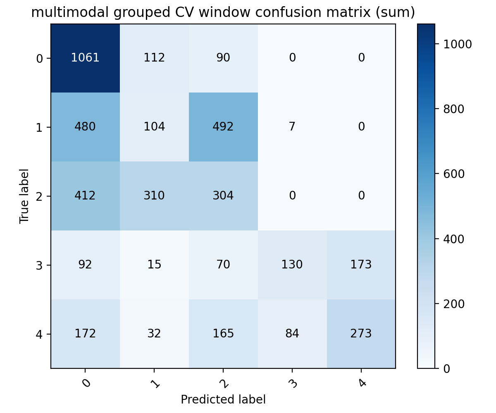
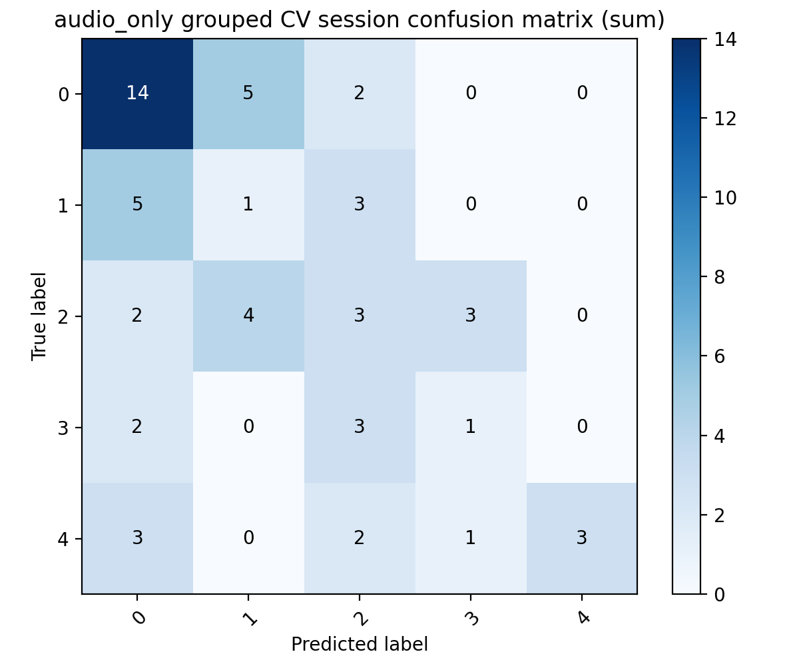
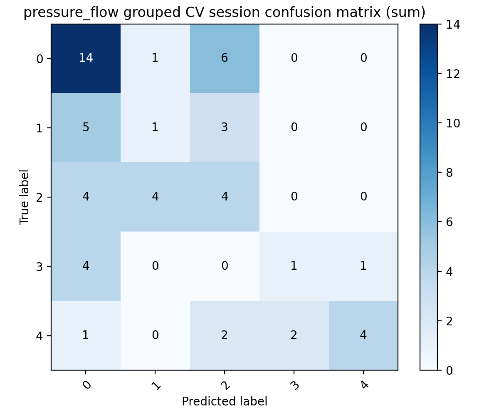
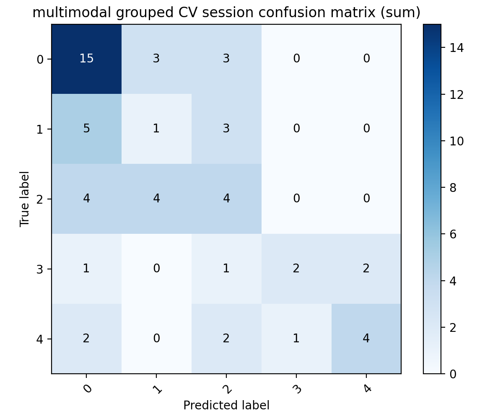

# Grouped CV 五分类稳定性报告

## 1. 实验设置

- python 环境: `dl`
- 数据与模型: 完全复用 `baseline_5class`，不改动核心预处理与模型结构
- group 单位: `recording/session`
- grouped CV: `StratifiedGroupKFold`, `3` repeats x `2` folds
- val 划分: 仅从每折训练集内部按 session 再划出一部分做早停，不与测试 group 重叠
- 限制: 3 ml 仅有 2 个 session，因此只能使用 2-fold grouped CV；更高 fold 数不成立。

## 2. 每折 split

- repeat1_fold1: train=['MMdata_1012.15s_0321_003441_yumi_4ml', 'MMdata_1136.50s_0327_183428_2ml', 'MMdata_195.00s_0322_230906_no_secretion', 'MMdata_1964.50s_0327_175903_1ml', 'MMdata_265.10s_0322_224132_no_secretion', 'MMdata_318.75s_0327_175326_no', 'MMdata_598.25s_0322_224923_no_secretion', 'MMdata_820.00s_0327_172321_2ml', 'MMdata_949.50s_0323_000227_4ml_yumi'], val=['MMdata_660.75s_0327_164500_no_secretion'], test=['MMdata_1000.00s_0327_191853_3ml', 'MMdata_1100.00s_0327_170159_1ml', 'MMdata_1200.00s_0322_232833_2ml_yumi', 'MMdata_1973.40s_0320_224508_no_secretion', 'MMdata_235.00s_0320_224031_no_secretion', 'MMdata_272.75s_0327_174501_2ml', 'MMdata_474.50s_0323_001822_4ml_yumi', 'MMdata_554.50s_0322_231552_1ml_yumi', 'MMdata_600.00s_0327_190504_3ml']
- repeat1_fold2: train=['MMdata_1000.00s_0327_191853_3ml', 'MMdata_1100.00s_0327_170159_1ml', 'MMdata_1200.00s_0322_232833_2ml_yumi', 'MMdata_1973.40s_0320_224508_no_secretion', 'MMdata_235.00s_0320_224031_no_secretion', 'MMdata_272.75s_0327_174501_2ml', 'MMdata_474.50s_0323_001822_4ml_yumi', 'MMdata_554.50s_0322_231552_1ml_yumi', 'MMdata_600.00s_0327_190504_3ml'], val=[], test=['MMdata_1012.15s_0321_003441_yumi_4ml', 'MMdata_1136.50s_0327_183428_2ml', 'MMdata_195.00s_0322_230906_no_secretion', 'MMdata_1964.50s_0327_175903_1ml', 'MMdata_265.10s_0322_224132_no_secretion', 'MMdata_318.75s_0327_175326_no', 'MMdata_598.25s_0322_224923_no_secretion', 'MMdata_660.75s_0327_164500_no_secretion', 'MMdata_820.00s_0327_172321_2ml', 'MMdata_949.50s_0323_000227_4ml_yumi']
- repeat2_fold1: train=['MMdata_1100.00s_0327_170159_1ml', 'MMdata_1200.00s_0322_232833_2ml_yumi', 'MMdata_1973.40s_0320_224508_no_secretion', 'MMdata_272.75s_0327_174501_2ml', 'MMdata_318.75s_0327_175326_no', 'MMdata_474.50s_0323_001822_4ml_yumi', 'MMdata_598.25s_0322_224923_no_secretion', 'MMdata_820.00s_0327_172321_2ml'], val=['MMdata_235.00s_0320_224031_no_secretion'], test=['MMdata_1000.00s_0327_191853_3ml', 'MMdata_1012.15s_0321_003441_yumi_4ml', 'MMdata_1136.50s_0327_183428_2ml', 'MMdata_195.00s_0322_230906_no_secretion', 'MMdata_1964.50s_0327_175903_1ml', 'MMdata_265.10s_0322_224132_no_secretion', 'MMdata_554.50s_0322_231552_1ml_yumi', 'MMdata_600.00s_0327_190504_3ml', 'MMdata_660.75s_0327_164500_no_secretion', 'MMdata_949.50s_0323_000227_4ml_yumi']
- repeat2_fold2: train=['MMdata_1000.00s_0327_191853_3ml', 'MMdata_1012.15s_0321_003441_yumi_4ml', 'MMdata_1136.50s_0327_183428_2ml', 'MMdata_195.00s_0322_230906_no_secretion', 'MMdata_1964.50s_0327_175903_1ml', 'MMdata_265.10s_0322_224132_no_secretion', 'MMdata_554.50s_0322_231552_1ml_yumi', 'MMdata_600.00s_0327_190504_3ml', 'MMdata_660.75s_0327_164500_no_secretion', 'MMdata_949.50s_0323_000227_4ml_yumi'], val=[], test=['MMdata_1100.00s_0327_170159_1ml', 'MMdata_1200.00s_0322_232833_2ml_yumi', 'MMdata_1973.40s_0320_224508_no_secretion', 'MMdata_235.00s_0320_224031_no_secretion', 'MMdata_272.75s_0327_174501_2ml', 'MMdata_318.75s_0327_175326_no', 'MMdata_474.50s_0323_001822_4ml_yumi', 'MMdata_598.25s_0322_224923_no_secretion', 'MMdata_820.00s_0327_172321_2ml']
- repeat3_fold1: train=['MMdata_1012.15s_0321_003441_yumi_4ml', 'MMdata_1100.00s_0327_170159_1ml', 'MMdata_1964.50s_0327_175903_1ml', 'MMdata_1973.40s_0320_224508_no_secretion', 'MMdata_235.00s_0320_224031_no_secretion', 'MMdata_318.75s_0327_175326_no', 'MMdata_474.50s_0323_001822_4ml_yumi', 'MMdata_600.00s_0327_190504_3ml', 'MMdata_949.50s_0323_000227_4ml_yumi'], val=[], test=['MMdata_1000.00s_0327_191853_3ml', 'MMdata_1136.50s_0327_183428_2ml', 'MMdata_1200.00s_0322_232833_2ml_yumi', 'MMdata_195.00s_0322_230906_no_secretion', 'MMdata_265.10s_0322_224132_no_secretion', 'MMdata_272.75s_0327_174501_2ml', 'MMdata_554.50s_0322_231552_1ml_yumi', 'MMdata_598.25s_0322_224923_no_secretion', 'MMdata_660.75s_0327_164500_no_secretion', 'MMdata_820.00s_0327_172321_2ml']
- repeat3_fold2: train=['MMdata_1000.00s_0327_191853_3ml', 'MMdata_1136.50s_0327_183428_2ml', 'MMdata_1200.00s_0322_232833_2ml_yumi', 'MMdata_195.00s_0322_230906_no_secretion', 'MMdata_265.10s_0322_224132_no_secretion', 'MMdata_272.75s_0327_174501_2ml', 'MMdata_554.50s_0322_231552_1ml_yumi', 'MMdata_660.75s_0327_164500_no_secretion'], val=['MMdata_598.25s_0322_224923_no_secretion', 'MMdata_820.00s_0327_172321_2ml'], test=['MMdata_1012.15s_0321_003441_yumi_4ml', 'MMdata_1100.00s_0327_170159_1ml', 'MMdata_1964.50s_0327_175903_1ml', 'MMdata_1973.40s_0320_224508_no_secretion', 'MMdata_235.00s_0320_224031_no_secretion', 'MMdata_318.75s_0327_175326_no', 'MMdata_474.50s_0323_001822_4ml_yumi', 'MMdata_600.00s_0327_190504_3ml', 'MMdata_949.50s_0323_000227_4ml_yumi']

## 3. 每折结果

| Fold | Model | Window Acc | Window F1 | Window P | Window R | Session Acc | Session F1 |
| --- | --- | --- | --- | --- | --- | --- | --- |
| repeat1_fold1 | audio_only | 0.2977 | 0.0975 | 0.0644 | 0.2000 | 0.2222 | 0.0727 |
| repeat1_fold2 | audio_only | 0.4307 | 0.3142 | 0.3627 | 0.3461 | 0.4000 | 0.3238 |
| repeat2_fold1 | audio_only | 0.4289 | 0.3819 | 0.5335 | 0.5262 | 0.5000 | 0.3667 |
| repeat2_fold2 | audio_only | 0.5862 | 0.4892 | 0.4761 | 0.5619 | 0.4444 | 0.4133 |
| repeat3_fold1 | audio_only | 0.3943 | 0.3170 | 0.2667 | 0.3918 | 0.5000 | 0.3111 |
| repeat3_fold2 | audio_only | 0.2747 | 0.2140 | 0.2077 | 0.2236 | 0.2222 | 0.1600 |
| repeat1_fold1 | pressure_flow | 0.3545 | 0.2827 | 0.2586 | 0.3787 | 0.3333 | 0.2800 |
| repeat1_fold2 | pressure_flow | 0.3482 | 0.2279 | 0.3462 | 0.2805 | 0.3000 | 0.2133 |
| repeat2_fold1 | pressure_flow | 0.2446 | 0.1816 | 0.2308 | 0.2944 | 0.4000 | 0.2333 |
| repeat2_fold2 | pressure_flow | 0.7098 | 0.5747 | 0.6399 | 0.6149 | 0.7778 | 0.6314 |
| repeat3_fold1 | pressure_flow | 0.2549 | 0.1393 | 0.1069 | 0.2000 | 0.4000 | 0.1600 |
| repeat3_fold2 | pressure_flow | 0.3562 | 0.3395 | 0.4087 | 0.3822 | 0.3333 | 0.2933 |
| repeat1_fold1 | multimodal | 0.3559 | 0.1902 | 0.1283 | 0.3830 | 0.3333 | 0.2000 |
| repeat1_fold2 | multimodal | 0.4473 | 0.3286 | 0.3865 | 0.3590 | 0.4000 | 0.3048 |
| repeat2_fold1 | multimodal | 0.2446 | 0.1855 | 0.2334 | 0.2944 | 0.4000 | 0.2424 |
| repeat2_fold2 | multimodal | 0.7802 | 0.6314 | 0.6784 | 0.6633 | 0.7778 | 0.6314 |
| repeat3_fold1 | multimodal | 0.3598 | 0.2888 | 0.2899 | 0.3400 | 0.5000 | 0.3600 |
| repeat3_fold2 | multimodal | 0.3155 | 0.2961 | 0.2765 | 0.3681 | 0.3333 | 0.2933 |

## 4. 平均结果表

| Model | Window Acc | Window F1 | Window P | Window R | Session Acc | Session F1 |
| --- | --- | --- | --- | --- | --- | --- |
| audio_only | 0.4021 ± 0.1022 | 0.3023 ± 0.1234 | 0.3185 ± 0.1595 | 0.3749 ± 0.1369 | 0.3815 ± 0.1177 | 0.2746 ± 0.1193 |
| pressure_flow | 0.3780 ± 0.1554 | 0.2910 ± 0.1425 | 0.3318 ± 0.1669 | 0.3585 ± 0.1304 | 0.4241 ± 0.1623 | 0.3019 ± 0.1537 |
| multimodal | 0.4172 ± 0.1731 | 0.3201 ± 0.1492 | 0.3322 ± 0.1727 | 0.4013 ± 0.1204 | 0.4574 ± 0.1537 | 0.3387 ± 0.1402 |

## 5. 混淆矩阵图

### 窗口级汇总

### Session 聚合汇总

各折单独混淆矩阵保存在 `outputs/grouped_cv_5class/repeat*_fold*/<model>/` 子目录下。

## 6. 稳定性与局限性总结

- 三模态在 grouped CV 下的平均窗口级 macro-F1 为 `0.3201`，高于 `pressure_flow` 的 `0.2910` 和 `audio_only` 的 `0.3023`，说明优势不是单次随机划分偶然得到的。
- `pressure+flow` 在窗口级平均 macro-F1 为 `0.2910`，略低于 `audio_only` 的 `0.3023`；但在 session 聚合后，`pressure+flow` 的平均 macro-F1 更高，说明传感器模态对 recording 级判别仍有价值，但优势不如单次 baseline 明显。
- 最佳模型的相邻类别混淆仍主要集中在 `1 ml` 与 `2 ml` 附近：1<->2 共 `802`，而 2<->3 为 `70`，3<->4 为 `257`。
- `0 ml` 与 `4 ml` 在三模态聚合混淆矩阵中的互相混淆总数为 `172`，明显少于 `1<->2` 的 `802`，说明负荷两端仍比中间相邻组更容易区分，但并非完全分离。
- 限制仍然明显：`3 ml` 仅有 2 个 session，因此这里只能做 2-fold grouped CV；结论是初步稳定性验证，不应解读为充分统计结论。
