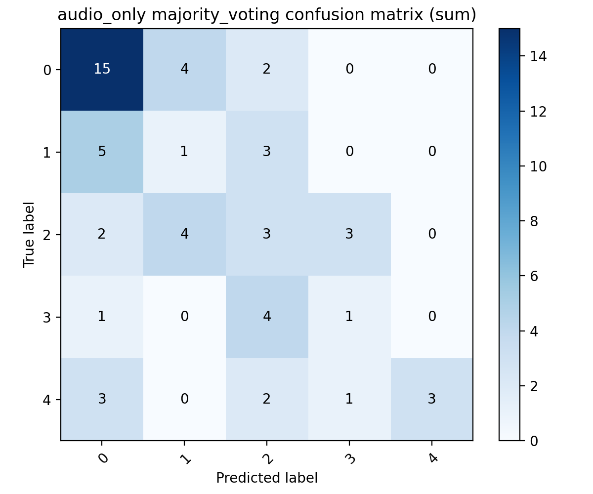
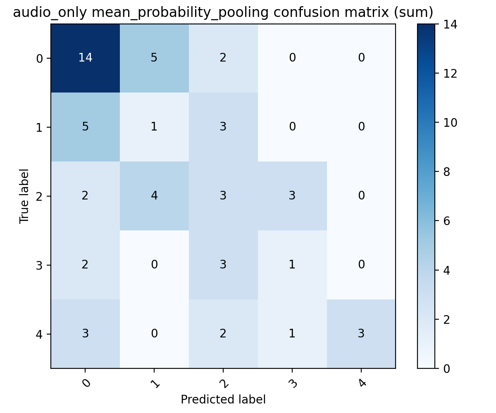
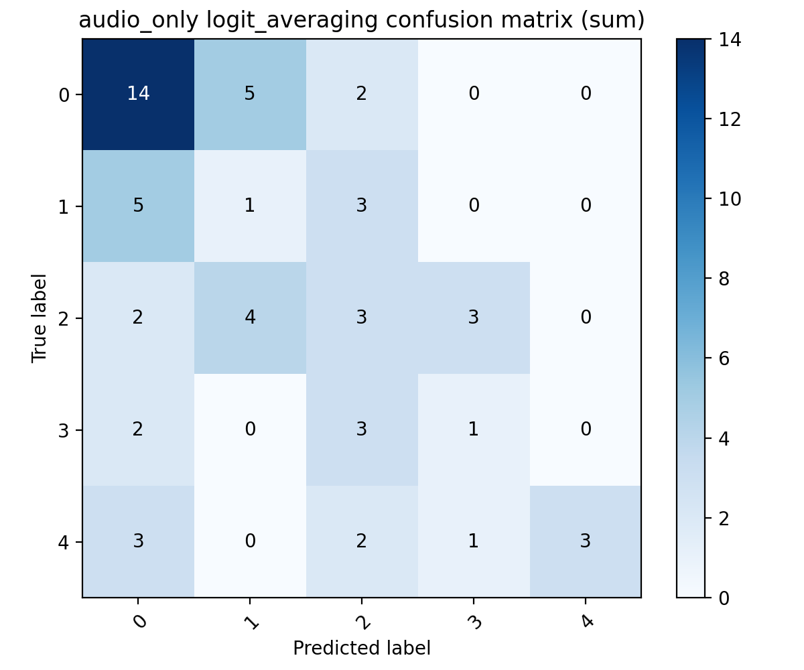
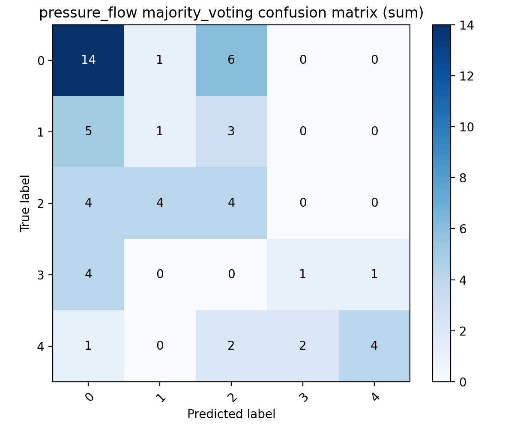
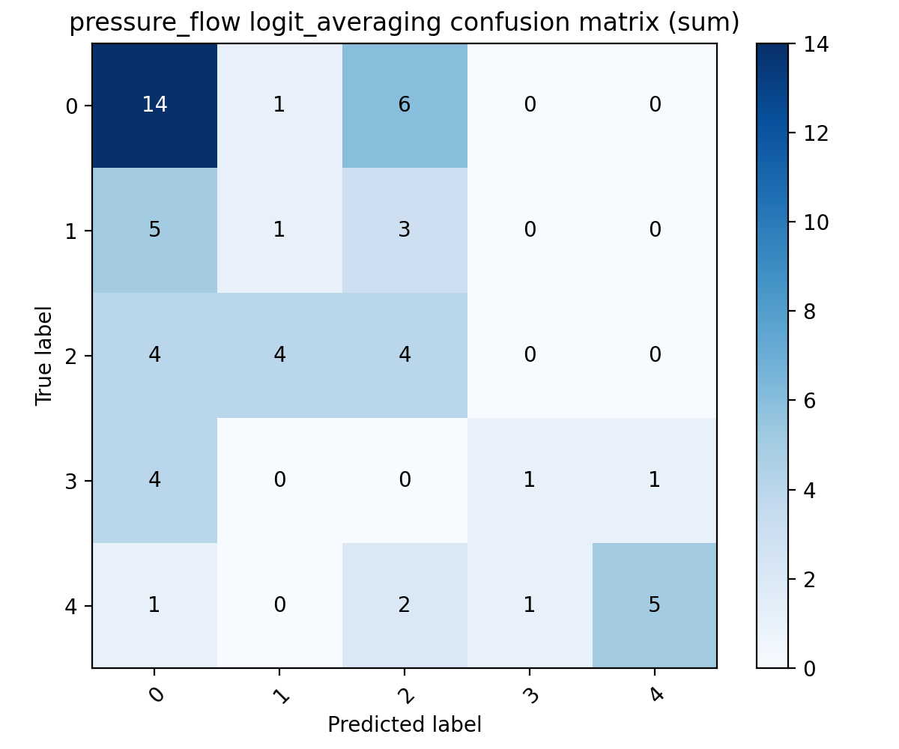
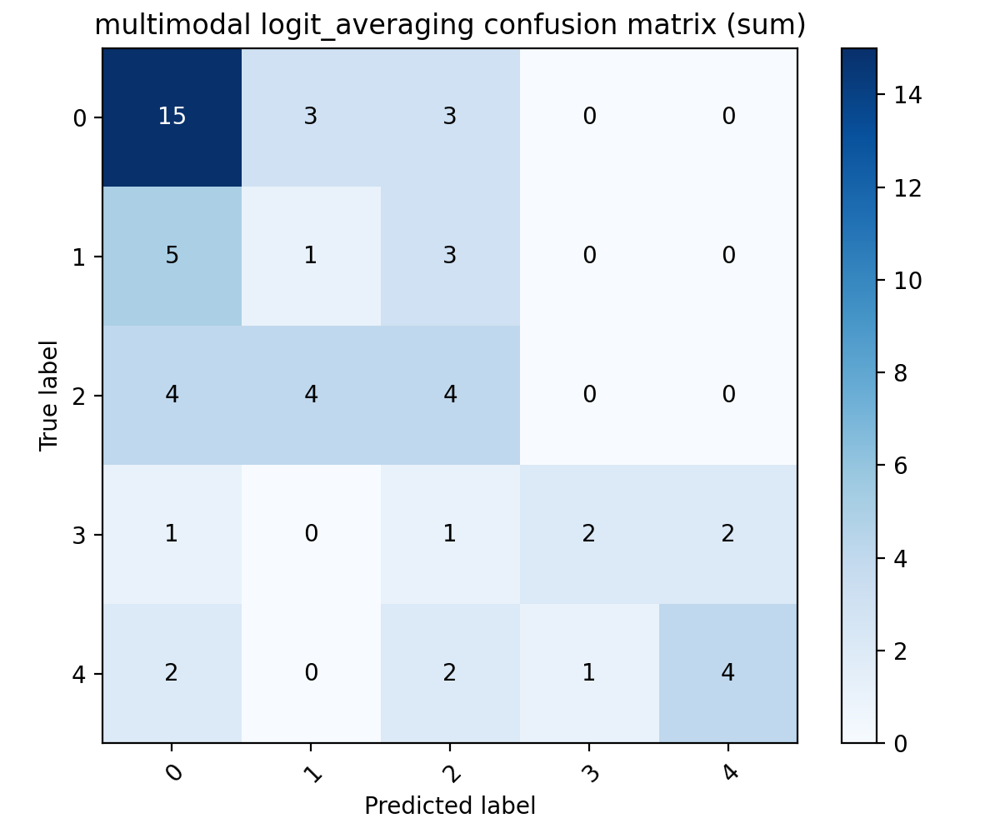

# Session-Level Aggregation 报告

## 1. 聚合方法说明

- `majority_voting`: 对同一测试 session 内所有窗口的预测类别做多数投票
- `mean_probability_pooling`: 对同一 session 内所有窗口的类别概率做均值，再取 argmax
- `logit_averaging`: 对同一 session 内所有窗口的 log-probability 做均值，再取 argmax
- 说明: 原始 grouped CV 输出保存的是概率而不是 raw logits；由于 logits 与 log-probabilities 只差每窗口一个类别无关常数，分类 argmax 不变

## 2. 整体结果对比

| Model | Eval | Acc | Macro-F1 | Precision | Recall |
| --- | --- | --- | --- | --- | --- |
| audio_only | window_level | 0.4021 ± 0.1022 | 0.3023 ± 0.1234 | 0.3185 ± 0.1595 | 0.3749 ± 0.1369 |
| audio_only | majority_voting | 0.4000 ± 0.1338 | 0.2855 ± 0.1299 | 0.2906 ± 0.1389 | 0.3539 ± 0.1497 |
| audio_only | mean_probability_pooling | 0.3815 ± 0.1177 | 0.2746 ± 0.1193 | 0.2869 ± 0.1371 | 0.3456 ± 0.1396 |
| audio_only | logit_averaging | 0.3815 ± 0.1177 | 0.2746 ± 0.1193 | 0.2869 ± 0.1371 | 0.3456 ± 0.1396 |
| pressure_flow | window_level | 0.3780 ± 0.1554 | 0.2910 ± 0.1425 | 0.3318 ± 0.1669 | 0.3585 ± 0.1304 |
| pressure_flow | majority_voting | 0.4241 ± 0.1623 | 0.3019 ± 0.1537 | 0.3111 ± 0.1671 | 0.3694 ± 0.1523 |
| pressure_flow | mean_probability_pooling | 0.4241 ± 0.1623 | 0.3019 ± 0.1537 | 0.3111 ± 0.1671 | 0.3694 ± 0.1523 |
| pressure_flow | logit_averaging | 0.4407 ± 0.1536 | 0.3130 ± 0.1493 | 0.3111 ± 0.1671 | 0.3861 ± 0.1492 |
| multimodal | window_level | 0.4172 ± 0.1731 | 0.3201 ± 0.1492 | 0.3322 ± 0.1727 | 0.4013 ± 0.1204 |
| multimodal | majority_voting | 0.4574 ± 0.1537 | 0.3387 ± 0.1402 | 0.3481 ± 0.1615 | 0.4094 ± 0.1277 |
| multimodal | mean_probability_pooling | 0.4574 ± 0.1537 | 0.3387 ± 0.1402 | 0.3481 ± 0.1615 | 0.4094 ± 0.1277 |
| multimodal | logit_averaging | 0.4574 ± 0.1537 | 0.3387 ± 0.1402 | 0.3481 ± 0.1615 | 0.4094 ± 0.1277 |

## 3. 每折结果

| Fold | Model | Eval | Acc | Macro-F1 | Precision | Recall |
| --- | --- | --- | --- | --- | --- | --- |
| repeat1_fold1 | audio_only | window_level | 0.2977 | 0.0975 | 0.0644 | 0.2000 |
| repeat1_fold2 | audio_only | window_level | 0.4307 | 0.3142 | 0.3627 | 0.3461 |
| repeat2_fold1 | audio_only | window_level | 0.4289 | 0.3819 | 0.5335 | 0.5262 |
| repeat2_fold2 | audio_only | window_level | 0.5862 | 0.4892 | 0.4761 | 0.5619 |
| repeat3_fold1 | audio_only | window_level | 0.3943 | 0.3170 | 0.2667 | 0.3918 |
| repeat3_fold2 | audio_only | window_level | 0.2747 | 0.2140 | 0.2077 | 0.2236 |
| repeat1_fold1 | audio_only | majority_voting | 0.2222 | 0.0800 | 0.0500 | 0.2000 |
| repeat1_fold2 | audio_only | majority_voting | 0.4000 | 0.3238 | 0.4000 | 0.3400 |
| repeat2_fold1 | audio_only | majority_voting | 0.5000 | 0.3667 | 0.3667 | 0.5000 |
| repeat2_fold2 | audio_only | majority_voting | 0.5556 | 0.4714 | 0.4667 | 0.5500 |
| repeat3_fold1 | audio_only | majority_voting | 0.5000 | 0.3111 | 0.2600 | 0.4000 |
| repeat3_fold2 | audio_only | majority_voting | 0.2222 | 0.1600 | 0.2000 | 0.1333 |
| repeat1_fold1 | audio_only | mean_probability_pooling | 0.2222 | 0.0727 | 0.0444 | 0.2000 |
| repeat1_fold2 | audio_only | mean_probability_pooling | 0.4000 | 0.3238 | 0.4000 | 0.3400 |
| repeat2_fold1 | audio_only | mean_probability_pooling | 0.5000 | 0.3667 | 0.3667 | 0.5000 |
| repeat2_fold2 | audio_only | mean_probability_pooling | 0.4444 | 0.4133 | 0.4500 | 0.5000 |
| repeat3_fold1 | audio_only | mean_probability_pooling | 0.5000 | 0.3111 | 0.2600 | 0.4000 |
| repeat3_fold2 | audio_only | mean_probability_pooling | 0.2222 | 0.1600 | 0.2000 | 0.1333 |
| repeat1_fold1 | audio_only | logit_averaging | 0.2222 | 0.0727 | 0.0444 | 0.2000 |
| repeat1_fold2 | audio_only | logit_averaging | 0.4000 | 0.3238 | 0.4000 | 0.3400 |
| repeat2_fold1 | audio_only | logit_averaging | 0.5000 | 0.3667 | 0.3667 | 0.5000 |
| repeat2_fold2 | audio_only | logit_averaging | 0.4444 | 0.4133 | 0.4500 | 0.5000 |
| repeat3_fold1 | audio_only | logit_averaging | 0.5000 | 0.3111 | 0.2600 | 0.4000 |
| repeat3_fold2 | audio_only | logit_averaging | 0.2222 | 0.1600 | 0.2000 | 0.1333 |
| repeat1_fold1 | pressure_flow | window_level | 0.3545 | 0.2827 | 0.2586 | 0.3787 |
| repeat1_fold2 | pressure_flow | window_level | 0.3482 | 0.2279 | 0.3462 | 0.2805 |
| repeat2_fold1 | pressure_flow | window_level | 0.2446 | 0.1816 | 0.2308 | 0.2944 |
| repeat2_fold2 | pressure_flow | window_level | 0.7098 | 0.5747 | 0.6399 | 0.6149 |
| repeat3_fold1 | pressure_flow | window_level | 0.2549 | 0.1393 | 0.1069 | 0.2000 |
| repeat3_fold2 | pressure_flow | window_level | 0.3562 | 0.3395 | 0.4087 | 0.3822 |
| repeat1_fold1 | pressure_flow | majority_voting | 0.3333 | 0.2800 | 0.2500 | 0.4000 |
| repeat1_fold2 | pressure_flow | majority_voting | 0.3000 | 0.2133 | 0.2500 | 0.3000 |
| repeat2_fold1 | pressure_flow | majority_voting | 0.4000 | 0.2333 | 0.2667 | 0.3000 |
| repeat2_fold2 | pressure_flow | majority_voting | 0.7778 | 0.6314 | 0.6667 | 0.6833 |
| repeat3_fold1 | pressure_flow | majority_voting | 0.4000 | 0.1600 | 0.1333 | 0.2000 |
| repeat3_fold2 | pressure_flow | majority_voting | 0.3333 | 0.2933 | 0.3000 | 0.3333 |
| repeat1_fold1 | pressure_flow | mean_probability_pooling | 0.3333 | 0.2800 | 0.2500 | 0.4000 |
| repeat1_fold2 | pressure_flow | mean_probability_pooling | 0.3000 | 0.2133 | 0.2500 | 0.3000 |
| repeat2_fold1 | pressure_flow | mean_probability_pooling | 0.4000 | 0.2333 | 0.2667 | 0.3000 |
| repeat2_fold2 | pressure_flow | mean_probability_pooling | 0.7778 | 0.6314 | 0.6667 | 0.6833 |
| repeat3_fold1 | pressure_flow | mean_probability_pooling | 0.4000 | 0.1600 | 0.1333 | 0.2000 |
| repeat3_fold2 | pressure_flow | mean_probability_pooling | 0.3333 | 0.2933 | 0.3000 | 0.3333 |
| repeat1_fold1 | pressure_flow | logit_averaging | 0.3333 | 0.2800 | 0.2500 | 0.4000 |
| repeat1_fold2 | pressure_flow | logit_averaging | 0.4000 | 0.2800 | 0.2500 | 0.4000 |
| repeat2_fold1 | pressure_flow | logit_averaging | 0.4000 | 0.2333 | 0.2667 | 0.3000 |
| repeat2_fold2 | pressure_flow | logit_averaging | 0.7778 | 0.6314 | 0.6667 | 0.6833 |
| repeat3_fold1 | pressure_flow | logit_averaging | 0.4000 | 0.1600 | 0.1333 | 0.2000 |
| repeat3_fold2 | pressure_flow | logit_averaging | 0.3333 | 0.2933 | 0.3000 | 0.3333 |
| repeat1_fold1 | multimodal | window_level | 0.3559 | 0.1902 | 0.1283 | 0.3830 |
| repeat1_fold2 | multimodal | window_level | 0.4473 | 0.3286 | 0.3865 | 0.3590 |
| repeat2_fold1 | multimodal | window_level | 0.2446 | 0.1855 | 0.2334 | 0.2944 |
| repeat2_fold2 | multimodal | window_level | 0.7802 | 0.6314 | 0.6784 | 0.6633 |
| repeat3_fold1 | multimodal | window_level | 0.3598 | 0.2888 | 0.2899 | 0.3400 |
| repeat3_fold2 | multimodal | window_level | 0.3155 | 0.2961 | 0.2765 | 0.3681 |
| repeat1_fold1 | multimodal | majority_voting | 0.3333 | 0.2000 | 0.1333 | 0.4000 |
| repeat1_fold2 | multimodal | majority_voting | 0.4000 | 0.3048 | 0.3800 | 0.3400 |
| repeat2_fold1 | multimodal | majority_voting | 0.4000 | 0.2424 | 0.2750 | 0.3000 |
| repeat2_fold2 | multimodal | majority_voting | 0.7778 | 0.6314 | 0.6667 | 0.6833 |
| repeat3_fold1 | multimodal | majority_voting | 0.5000 | 0.3600 | 0.3333 | 0.4000 |
| repeat3_fold2 | multimodal | majority_voting | 0.3333 | 0.2933 | 0.3000 | 0.3333 |
| repeat1_fold1 | multimodal | mean_probability_pooling | 0.3333 | 0.2000 | 0.1333 | 0.4000 |
| repeat1_fold2 | multimodal | mean_probability_pooling | 0.4000 | 0.3048 | 0.3800 | 0.3400 |
| repeat2_fold1 | multimodal | mean_probability_pooling | 0.4000 | 0.2424 | 0.2750 | 0.3000 |
| repeat2_fold2 | multimodal | mean_probability_pooling | 0.7778 | 0.6314 | 0.6667 | 0.6833 |
| repeat3_fold1 | multimodal | mean_probability_pooling | 0.5000 | 0.3600 | 0.3333 | 0.4000 |
| repeat3_fold2 | multimodal | mean_probability_pooling | 0.3333 | 0.2933 | 0.3000 | 0.3333 |
| repeat1_fold1 | multimodal | logit_averaging | 0.3333 | 0.2000 | 0.1333 | 0.4000 |
| repeat1_fold2 | multimodal | logit_averaging | 0.4000 | 0.3048 | 0.3800 | 0.3400 |
| repeat2_fold1 | multimodal | logit_averaging | 0.4000 | 0.2424 | 0.2750 | 0.3000 |
| repeat2_fold2 | multimodal | logit_averaging | 0.7778 | 0.6314 | 0.6667 | 0.6833 |
| repeat3_fold1 | multimodal | logit_averaging | 0.5000 | 0.3600 | 0.3333 | 0.4000 |
| repeat3_fold2 | multimodal | logit_averaging | 0.3333 | 0.2933 | 0.3000 | 0.3333 |

## 4. 混淆矩阵

### 三模态最佳聚合方式

最佳方式: `majority_voting`

### 全模型全方法汇总图

## 5. 结果解释与局限性

- 对三模态模型，session-level 聚合把平均 macro-F1 从 window-level 的 `0.3201` 提升到最佳聚合方式 `majority_voting` 的 `0.3387`，说明对 recording/session 粒度的判别更稳定。
- 聚合增益具有模态差异：`audio_only` 的最佳 session-level macro-F1 从 `0.3023` 变为 `0.2855`，没有带来提升；`pressure_flow` 则从 `0.2910` 提升到 `0.3130`，说明聚合更适合传感器或多模态场景。
- multimodal 在 session-level 下的优势更明显：其最佳 session-level macro-F1 高于 `audio_only` 与 `pressure_flow` 的最佳 session-level 结果。
- 在最佳三模态聚合混淆矩阵中，`1 ml` 与 `2 ml` 的互相混淆仍最多，共 `7` 次；`0 ml` 与 `4 ml` 的互相混淆为 `2` 次，仍明显更少。
- 限制没有变化：所有分析都严格复用 grouped CV 的 session 划分，未发生 session 泄漏；但由于 `3 ml` session 极少，折间波动仍然较大。
