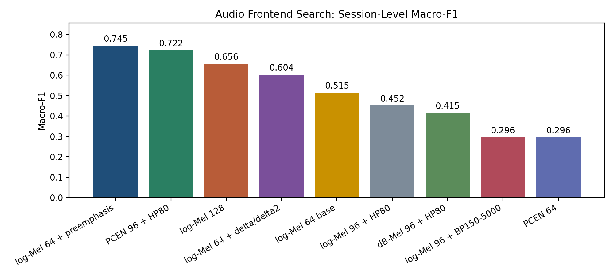

# Audio Frontend Search Report

## 1. Setup

- task: `0 / 2 / 4` 三分类
- split: grouped CV，先按 session 划分再切窗
- window: `5 s`
- model: `audio_only`
- goal: 在不改分类器主干的前提下，比较不同音频前端的判别能力

## 2. Results

| Frontend | Window F1 | Best Session Method | Session F1 | Session Acc |
| --- | --- | --- | --- | --- |
| log-Mel 64 + preemphasis | 0.6501 ± 0.1485 | majority_voting | 0.7450 ± 0.2459 | 0.7778 ± 0.2079 |
| PCEN 96 + HP80 | 0.5962 ± 0.1901 | logit_averaging | 0.7222 ± 0.3928 | 0.7778 ± 0.3143 |
| log-Mel 128 | 0.6255 ± 0.2406 | majority_voting | 0.6561 ± 0.2501 | 0.7222 ± 0.2079 |
| log-Mel 64 + delta/delta2 | 0.6201 ± 0.2267 | majority_voting | 0.6037 ± 0.3090 | 0.6667 ± 0.2357 |
| log-Mel 64 base | 0.5444 ± 0.2490 | majority_voting | 0.5148 ± 0.2692 | 0.6111 ± 0.2079 |
| log-Mel 96 + HP80 | 0.5356 ± 0.1496 | majority_voting | 0.4524 ± 0.0736 | 0.5556 ± 0.0786 |
| dB-Mel 96 + HP80 | 0.3865 ± 0.1650 | majority_voting | 0.4153 ± 0.2041 | 0.5000 ± 0.1361 |
| log-Mel 96 + BP150-5000 | 0.3543 ± 0.1552 | majority_voting | 0.2963 ± 0.1833 | 0.4444 ± 0.1571 |
| PCEN 64 | 0.3719 ± 0.1307 | majority_voting | 0.2963 ± 0.1833 | 0.4444 ± 0.1571 |

## 3. Key Findings

- 当前最优前端是 `log-Mel 64 + preemphasis`，session-level macro-F1 为 `0.7450`
- 相比基线 `log-Mel 64 base`，最优前端的提升为 `0.2302`
- 当前最差前端是 `PCEN 64`，session-level macro-F1 为 `0.2963`

## 4. Next Step

- 将最优的 1 到 2 组音频前端回灌到 HCAF-Net，再验证多模态是否同步提升
- 如果 audio-only 提升明显但 HCAF 不升，问题更可能在融合层而不是音频表征
