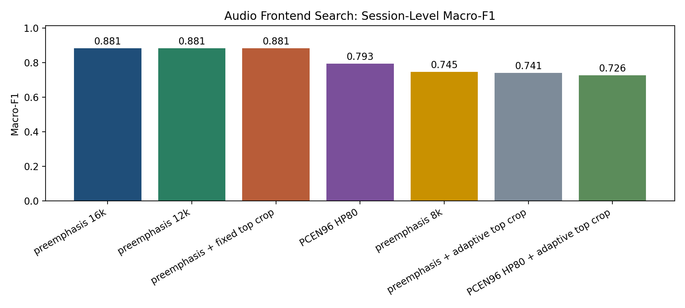

# Audio Frontend Search Report

## 1. Setup

- task: `0 / 2 / 4` 三分类
- split: grouped CV，先按 session 划分再切窗
- window: `5 s`
- model: `audio_only`
- goal: 在不改分类器主干的前提下，比较不同音频前端的判别能力

## 2. Results

| Frontend | Window F1 | Best Session Method | Session F1 | Session Acc |
| --- | --- | --- | --- | --- |
| preemphasis 16k | 0.8639 ± 0.0551 | majority_voting | 0.8815 ± 0.0838 | 0.8889 ± 0.0786 |
| preemphasis 12k | 0.8534 ± 0.1037 | majority_voting | 0.8815 ± 0.0838 | 0.8889 ± 0.0786 |
| preemphasis + fixed top crop | 0.8027 ± 0.1437 | majority_voting | 0.8815 ± 0.0838 | 0.8889 ± 0.0786 |
| PCEN96 HP80 | 0.6074 ± 0.0986 | mean_probability_pooling | 0.7926 ± 0.1826 | 0.8333 ± 0.1361 |
| preemphasis 8k | 0.6959 ± 0.2258 | majority_voting | 0.7450 ± 0.2459 | 0.7778 ± 0.2079 |
| preemphasis + adaptive top crop | 0.6920 ± 0.1251 | majority_voting | 0.7407 ± 0.1889 | 0.7778 ± 0.1571 |
| PCEN96 HP80 + adaptive top crop | 0.5821 ± 0.1395 | majority_voting | 0.7259 ± 0.1362 | 0.7778 ± 0.0786 |

## 3. Key Findings

- 当前最优前端是 `preemphasis 16k`，session-level macro-F1 为 `0.8815`
- 相比基线 `log-Mel 64 base`，最优前端的提升为 `0.0000`
- 当前最差前端是 `PCEN96 HP80 + adaptive top crop`，session-level macro-F1 为 `0.7259`

## 4. Next Step

- 将最优的 1 到 2 组音频前端回灌到 HCAF-Net，再验证多模态是否同步提升
- 如果 audio-only 提升明显但 HCAF 不升，问题更可能在融合层而不是音频表征
