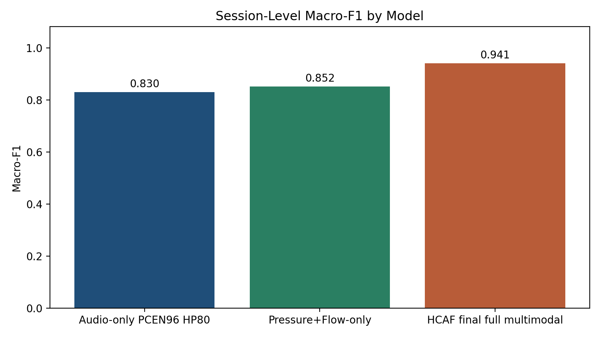
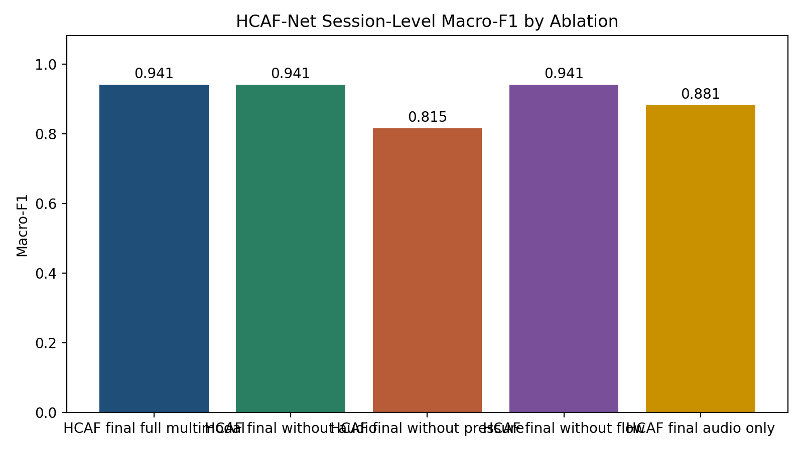
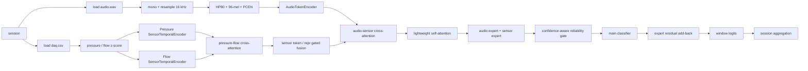
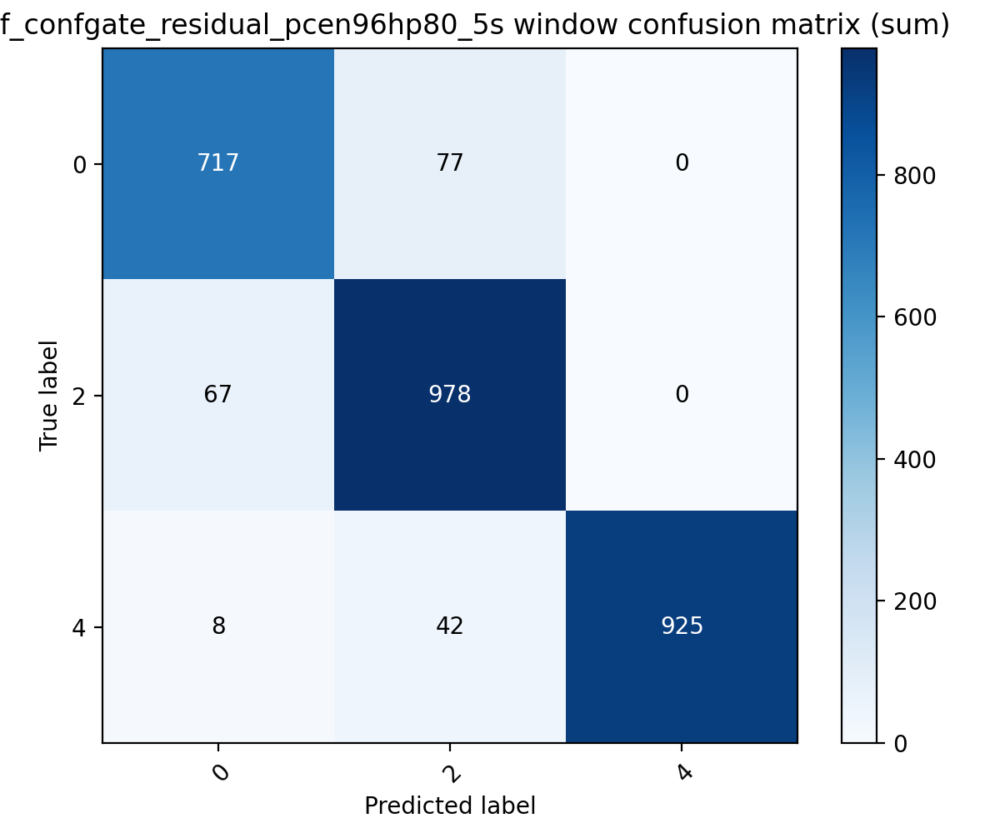
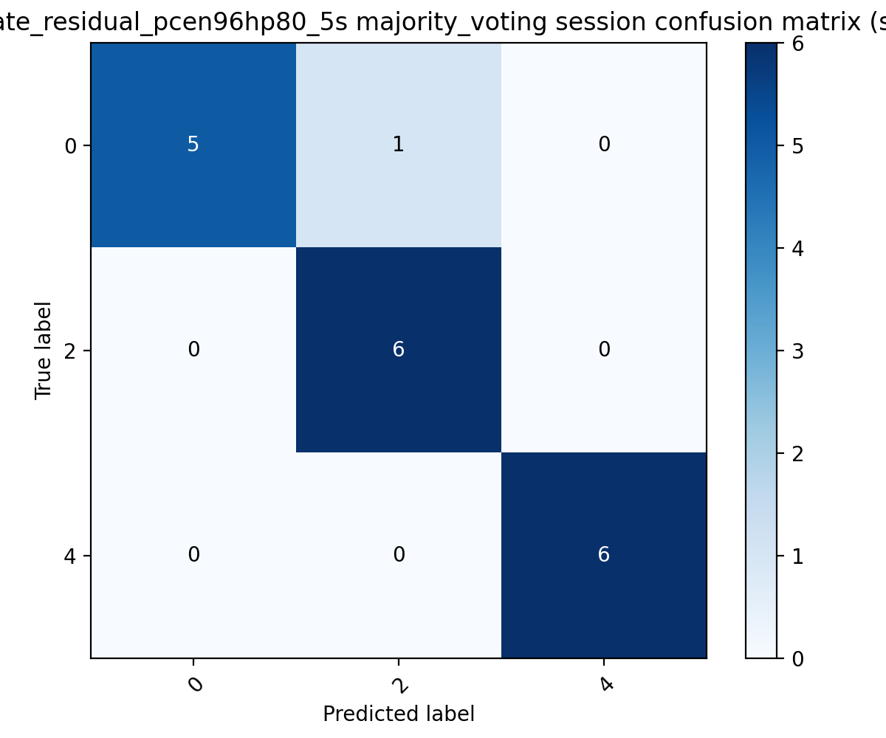
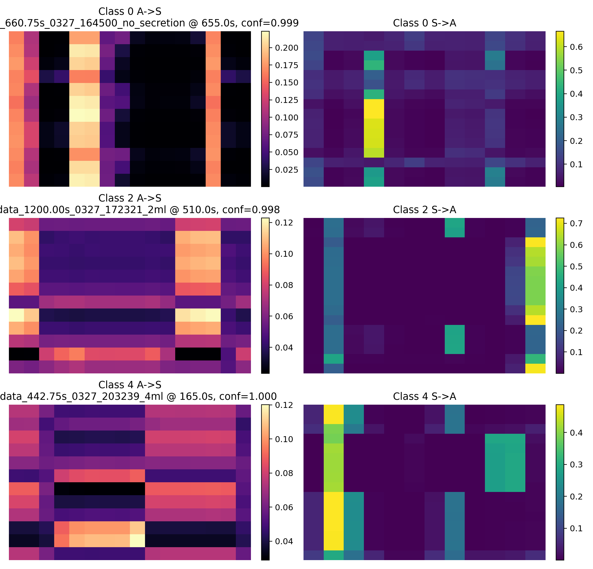
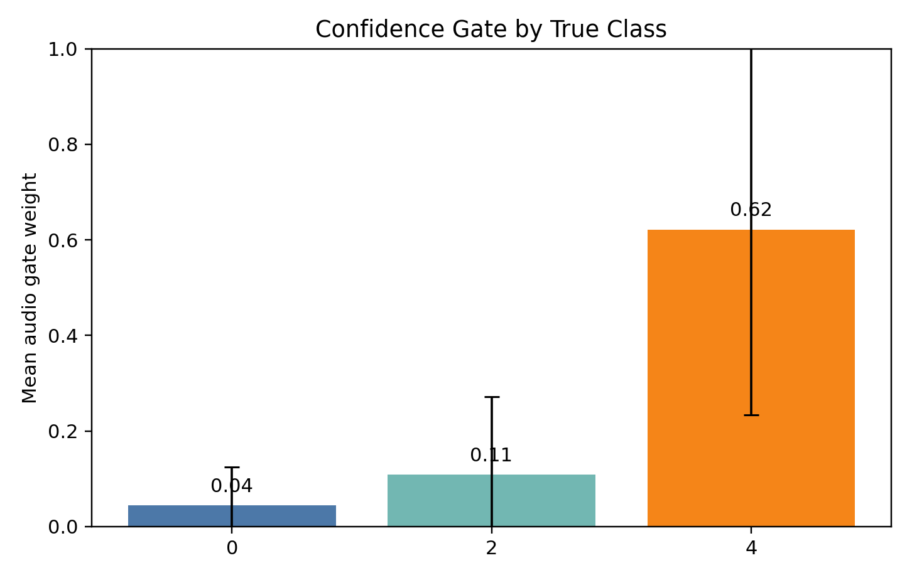
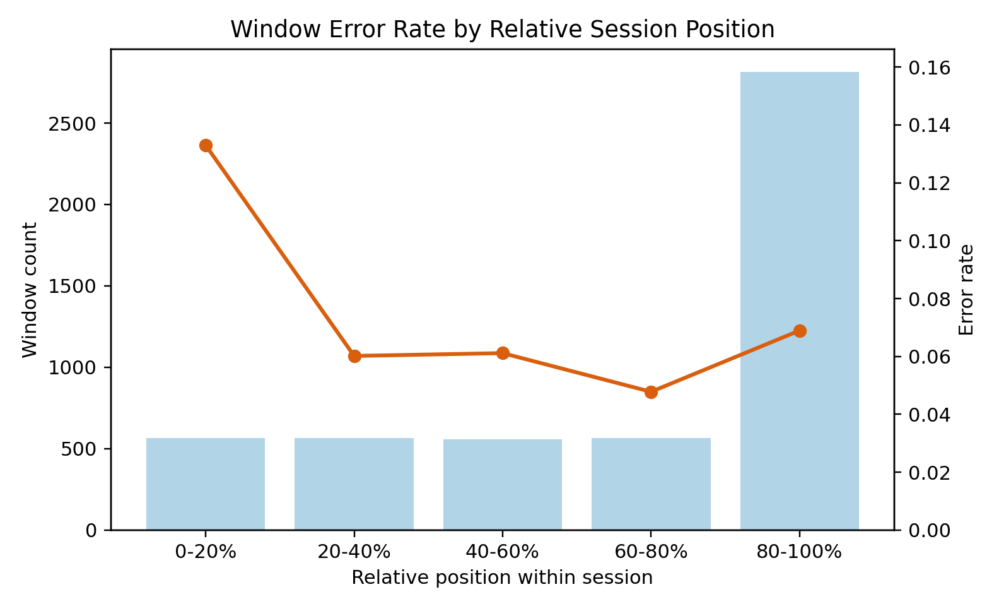

# 最终模型技术说明

## 1. 最终模型身份

- final_model: `hcaf_confgate_residual_pcen96hp80_5s`
- task: `0 / 2 / 4` 三分类
- modalities: `audio + pressure + flow`
- final_selection_date: `2026-04-01`
- final_model_config: `configs/hcaf_confgate_improve_search.yaml`
- final_evidence_config: `configs/final_model_unified_evidence.yaml`
- final_evidence_dir: `summary-MMmodel/final_model_unified_evidence`

最终保留的不是参数量最大的模型，也不是最近一次尝试里最复杂的编码器，而是同时满足下面 3 个条件的方案：

1. 在正式 grouped CV 下 session-level 指标最高
2. 后续补充搜索没有继续超过它
3. 结构、误差模式、缺失模态和单模态对照都能形成完整证据链

## 2. 统一评估协议

### 2.1 数据与切分

- 数据根目录: `data/`
- 任务标签: `0 / 2 / 4`
- 切分单位: `session`
- 评估方式: `1 repeat x 3 folds` grouped CV
- 验证集: 从 train sessions 内再划出 `25%`
- 主窗口长度: `5 s`
- hop length: `5 s`
- excluded session:
  - `MMdata_265.10s_0322_224132_no_secretion`

统一证据使用的 split manifest 为：

- `summary-MMmodel/pq_vs_multimodal_check/split_manifest.json`

这意味着最终主表、单模态对照和缺失模态分析现在都可以在同一份 split 上解释，不再需要跨不同目录手工拼接。

### 2.2 采样率与模态对齐

- audio sample rate: `16000 Hz`
- sensor sample rate: `100 Hz`
- 输入模态:
  - `audio.wav`
  - `daq.csv -> Pressure (cmH2O)`
  - `daq.csv -> Flowrate (L/min)`

每条记录在构建窗口前，都会先裁到三模态共同可覆盖的最短时长：

```text
duration_sec = min(audio_duration, pressure_duration, flow_duration)
```

然后再切 `5 s` 窗，以避免模态尾部越界和伪对齐。

## 3. 最终性能结论

### 3.1 多模态 vs 单一模态 / 双模态

统一口径下，主结果如下：

| model | source | window macro-F1 | session macro-F1 |
| --- | --- | ---: | ---: |
| `audio_only_pcen96hp80_5s` | `summary-MMmodel/final_model_unified_evidence` | `0.7052 ± 0.0667` | `0.8296 ± 0.1362` |
| `pressure_flow_5s` | `summary-MMmodel/final_model_unified_evidence` | `0.7499 ± 0.2513` | `0.8519 ± 0.2095` |
| `hcaf_confgate_residual_pcen96hp80_5s` | `summary-MMmodel/final_model_unified_evidence` | `0.9207 ± 0.0261` | `0.9407 ± 0.0838` |

因此最终模型相对基线的 session-level 提升为：

- vs `audio-only`: `+0.1111`
- vs `pressure+flow-only`: `+0.0889`

这一点满足“多模态结果好于单模态 / 传感器双模态参考”的最终目标。



### 3.2 缺失模态结果

为避免不同条件各自选择不同聚合方法带来解释偏差，下面统一固定使用 `majority_voting`：

| condition | session macro-F1 | delta vs full |
| --- | ---: | ---: |
| full multimodal | `0.9407 ± 0.0838` | `0.0000` |
| missing audio | `0.9407 ± 0.0838` | `0.0000` |
| missing pressure | `0.7556 ± 0.2317` | `-0.1852` |
| missing flow | `0.9407 ± 0.0838` | `0.0000` |
| HCAF audio only | `0.8815 ± 0.0838` | `-0.0593` |

解释时需要注意两点：

1. 这张表的价值是说明“缺失模态时系统如何退化或保持”，不是用来替代主表的模型选择逻辑。
2. 在当前统一 split 下，`missing audio` 和 `missing flow` 的 session majority 均值没有下降，但它们的 window-level 表现和内部表示已经变化，因此更合理的解读是“当前模型存在冗余路径”，而不是“这些模态没有价值”。

最终仍保留 full multimodal 作为正式模型，而不是直接改成 `missing audio` 或 `missing flow` 版本，原因是：

- 这些缺失模态设置本质上属于鲁棒性分析条件，不是主模型候选
- full multimodal 保留了最完整的输入信息
- full multimodal 仍然对应最完整的结构解释链、音频前端提升证据和主表叙述口径



## 4. 模型结构

### 4.1 整体数据流



### 4.2 编码器与融合模块

#### 4.2.1 PQ波形编码器结构

PQ 编码器对应 `mmdl_baseline/models/sensor_cnn.py` 中的 `SensorTemporalEncoder(encoder_type="tcn")`，pressure 与 flow 各使用一套同构分支。

输入形状：

```text
[B, 1, 500]
```

因为：

- 传感器采样率为 `100 Hz`
- 窗长为 `5 s`
- 每窗共有 `500` 个采样点

结构分为两部分：

1. `1D CNN stem`
2. `TCN temporal backbone`

`1D CNN stem` 为 3 层卷积：

```text
Conv1d(1 -> 16, kernel=9, stride=1, padding=4)
-> BatchNorm1d
-> GELU
-> Conv1d(16 -> 32, kernel=5, stride=2, padding=2)
-> BatchNorm1d
-> GELU
-> Conv1d(32 -> 64, kernel=5, stride=2, padding=2)
-> BatchNorm1d
-> GELU
```

`TCN backbone` 使用 `tcn_layers=2`，即 2 个 dilation TCN block：

- block 1: dilation=`1`
- block 2: dilation=`2`

每个 TCN block 内部都是：

```text
Conv1d(64 -> 64, kernel=3, dilation=d, padding=d)
-> BatchNorm1d
-> GELU
-> Dropout
-> Conv1d(64 -> 64, kernel=3, dilation=d, padding=d)
-> BatchNorm1d
-> GELU
-> residual add
-> Dropout
```

时序主干之后，PQ 分支会导出两种表示：

1. token branch
   - `AdaptiveAvgPool1d(16)`
   - `Conv1d(64 -> 128, kernel=1)`
   - 输出：

```text
[B, 16, 128]
```

2. summary branch
   - `AdaptiveAvgPool1d(1)`
   - `Linear(64 -> 128)`
   - `GELU`
   - 输出：

```text
[B, 128]
```

因此每条 PQ 分支最终都会输出：

- `16` 个 token
- `1` 个 `128` 维 summary vector

#### 4.2.2 呼吸音编码器结构

呼吸音分支使用 `AudioTokenEncoder(encoder_type="basic")`，输入不是原始波形，而是经过 `PCEN96 + HP80` 处理后的单通道时频图。

音频前端参数：

- feature_type: `pcen`
- n_mels: `96`
- f_min: `80.0`
- f_max: `6000.0`
- highpass_hz: `80.0`
- n_fft: `1024`
- win_length: `400`
- hop_length: `160`

输入形状可写为：

```text
[B, 1, 96, T]
```

主干由 3 个 2D CNN block 组成：

```text
Conv2d(kernel=3x3, padding=1)
-> BatchNorm2d
-> GELU
-> MaxPool2d(kernel=2)
```

通道变化为：

1. `1 -> 16`
2. `16 -> 32`
3. `32 -> 64`

输出同样分为两条支路：

1. token branch
   - `AdaptiveAvgPool2d((1, 12))`
   - `Conv1d(64 -> 128, kernel=1)`
   - 输出：

```text
[B, 12, 128]
```

2. summary branch
   - `AdaptiveAvgPool2d((1, 1))`
   - `Linear(64 -> 128)`
   - `GELU`
   - 输出：

```text
[B, 128]
```

最终音频分支输出：

- `12` 个 audio tokens
- `1` 个 `128` 维 audio summary

#### 4.2.3 融合结构设计

最终模型使用的是 `HCAFNet`，其融合顺序不是“三路直接拼接”，而是分层进行：

1. `pressure -> flow` 与 `flow -> pressure` 双向 cross-attention
2. `sensor_token_fusion` 与 `sensor_repr_fusion`
3. `audio -> sensor` 与 `sensor -> audio` 双向 cross-attention
4. `joint_tokens` 过 `1` 层 lightweight self-attention
5. 得到 `audio_repr` 与 `sensor_repr`
6. 用两路 expert 先分别产生 `audio_logits` 与 `sensor_logits`
7. 通过 `confidence-aware reliability gate` 输出两路权重
8. 主分类头输出 logits，再叠加 `expert residual`

可靠性门控使用了 3 类置信度特征：

- top-1 probability
- top-1 / top-2 margin
- `1 - entropy`

门控公式可写为：

```text
fused_repr = w_audio * audio_repr + w_sensor * sensor_repr
```

最终 logits 为：

```text
final_logits =
    classifier(fused_repr)
    + 0.3 * (w_audio * audio_logits + w_sensor * sensor_logits)
```

这也是最终模型与普通 HCAF 变体相比最关键的区别之一：

- `confidence-aware gate`
- `expert residual`

两者配合后，才形成了稳定且可复现的多模态收益。

## 5. 关键结构调整

### 5.1 Sensor normalization fix

早期版本中，pressure / flow 分支会复用 audio 的 `LayerNorm`。修复后，多模态结构才具备稳定的表示空间。

### 5.2 confidence-aware gate + expert residual

单独使用 `confidence-aware gate` 并不能稳定提升，只有和 `expert residual` 联合后，session-level 性能才第一次稳定超过传感器双模态参考。

### 5.3 音频前端升级

真正把最终指标从上一版 best 再推高的是：

- `PCEN`
- `96 mel bins`
- `80 Hz high-pass`

而不是继续堆更深的 encoder。

## 6. 训练超参数

- optimizer: `Adam`
- learning_rate: `1e-3`
- weight_decay: `1e-4`
- epochs: `8`
- early_stop_patience: `3`
- batch_size: `16`
- weighted_sampler: `True`
- loss: `cross_entropy`
- grad_clip_norm: `3.0`
- dropout: `0.3`
- modality_dropout: `0.1`
- embedding_dim: `128`
- fusion_hidden_dim: `128`
- num_heads: `4`
- tcn_layers: `2`
- audio_token_frames: `12`
- sensor_token_length: `16`
- self_attention_layers: `1`

## 7. 指标分析

### 7.1 为什么最终模型是当前最优口径

统一证据已经表明：

- full multimodal > `audio-only`
- full multimodal > `pressure+flow-only`
- full multimodal > `HCAF audio only`

也就是说，最终模型既不是“纯音频已经足够”，也不是“传感器双模态已经足够”，而是三模态与层次融合结构共同作用后的结果。

### 7.2 缺失模态怎么处理

模型原生支持缺失模态，不需要另起一个新架构。

实现机制有两层：

1. `enabled_modalities`
   - 显式指定某次实验可用的模态集合
2. `modality_dropout`
   - 训练时随机 mask 掉一部分模态
   - 正式最终模型使用 `modality_dropout = 0.1`

在 `HCAFNet` 内部：

- 每个 batch 会采样 `audio_mask / pressure_mask / flow_mask`
- 被 mask 的 token 和 summary 会直接乘零
- cross-attention、token fusion、reliability gate 会继续接收 availability mask
- 如果训练时所有模态都被 mask，代码会强制保留至少一个模态，避免空输入

因此这里的“缺失模态处理”不是后处理技巧，而是结构级支持。

### 7.3 混淆矩阵与错误模式

最终模型在统一口径下的混淆矩阵为：

窗口级：

```text
[[717,  77,   0],
 [ 67, 978,   0],
 [  8,  42, 925]]
```

session 级（majority voting）：

```text
[[5, 1, 0],
 [0, 6, 0],
 [0, 0, 6]]
```

可保留的误差判断：

- 主错误模式依然是 `0 -> 2`
- `2 -> 4` 不是主要混淆来源
- session-level 只剩 `1` 个 `0 -> 2` 错误





### 7.4 gate 与跨模态交互的解释证据

最终模型还保留了一组解释性结果：

- cross-attention 热图
- audio gate 按类别统计
- gate 与 expert confidence 的关系
- 边界位置错误率

对应目录：

- `summary-MMmodel/hcaf_confgate_interpretability`

可直接引用的图包括：







## 8. 为什么没有继续选更复杂的编码器

后续补充搜索已经覆盖了：

- `Audio ResNet18`
- 更复杂 PQ encoder
- 更大 batch size
- 更长 / 更短 attention token
- 额外 loss / modality dropout 调整

结论是：

- `Audio ResNet18` 可以追平当前 best，但没有继续超过
- 更复杂 PQ encoder 没有稳定涨点
- 继续堆大 backbone 只会增加说明成本，不会增加最终证据强度

因此最终保留的，仍然是当前这条：

- `basic audio token encoder`
- `PQ TCN encoder`
- `confidence-aware gate + expert residual`
- `PCEN96 + HP80`

## 9. 仍然存在的风险

- 缺失模态的重要性对 split 仍然敏感
  - 旧的一份 split 上，更像是 flow 更关键
  - 本轮统一 split 下，pressure removal 的退化最大
  - 因此不适合把“哪一个模态绝对最重要”写成过强结论
- 窗口级 `0 -> 2` 混淆仍然存在
- 当前没有事件级标注，无法进一步验证边界截断造成的局部错误
- 虽然 session-level 已很高，但样本规模仍有限，折间方差不可完全忽略

## 10. 建议引用表述

可以直接用于论文、答辩或技术汇报：

> 在统一的 session-grouped `1 repeat x 3 folds` 评估协议下，最终多模态模型 `hcaf_confgate_residual_pcen96hp80_5s` 的 session-level macro-F1 达到 `0.9407 ± 0.0838`。在完全相同的 split manifest 与训练预算下，该结果高于 `audio-only PCEN96 HP80` 的 `0.8296 ± 0.1362`，也高于 `pressure+flow-only` 的 `0.8519 ± 0.2095`。结果表明，最终性能的提升来自 `PCEN96 + HP80` 音频前端与 `confidence-aware gate + expert residual` 层次融合结构的共同作用，而不是单一模态或更大编码器自然带来的增益。
