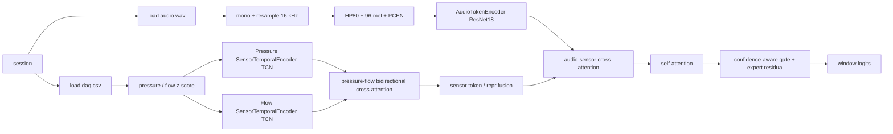

# 当前默认最佳模型技术说明

## 1. 模型身份

- display_name: `HCAF-PCEN-XAttn`
- experiment_id: `hcaf_confgate_residual_pcen96hp80_sa0_nosummary_5s`
- task: `0 / 2 / 4` 三分类
- modalities: `audio + pressure + flow`
- audio encoder: `AudioTokenEncoder`
- sensor encoder: `TCN`
- fusion: `PQ cross-attention + audio-sensor cross-attention + confidence-aware gate + expert residual`
- primary metric: `window macro-F1`
- main_config: `configs/hcaf_confgate_compression_search.yaml`
- main_result_dir: `outputs/hcaf_confgate_compression_search`

当前默认压缩版结构额外做了一个部署侧调整：

- `self_attention_layers = 0`
- `use_summary_in_repr = false`
- 即保留 `PQ <-> audio` 双向 cross-attention，但去掉 concat 之后的 joint self-attention，同时不再使用 `Mean(token) + summary` 的表示构造
- 这样做是为了压缩模型与减少计算量
- 已完成的压缩消融里，这个 `SA=0 + no-summary` 版本的 window macro-F1 为 `0.9155 ± 0.0133`，session macro-F1 为 `0.9407 ± 0.0838`
- 因此它是当前更推荐保留的压缩版默认结构
- 下文主表中的历史结果仍可用于对照完整模型上限

当前默认最佳模型已经切换到补充压缩实验确认后的 `HCAF-PCEN-XAttn`：

- 固定非对齐 `5 s` 窗
- `PCEN96 + HP80`
- `self_attention_layers = 0`
- `use_summary_in_repr = false`
- `confidence-aware gate + expert residual`

原因是这条压缩版在当前已完成的补充实验中：

- 相比仅去掉 self-attention 的 `SA=0 base` 更强
- 相比 `summary-token` 版本更稳定
- 相比 `PCEN64` 压缩前端更能守住 window-level 指标

## 2. 评估协议

### 2.1 为什么当前以 window-level 为主

当前记录级 `session` 有两个问题：

1. 时长很长
2. 长度不等

因此当前主线不再用 `session-level` 作为第一选择标准，而改用：

- `window macro-F1`

`session-level` 仍然保留，但主要作为辅助观察，而不是决定当前最终主模型的唯一依据。

### 2.2 数据与切分

- 数据根目录: `data/`
- 标签: `0 / 2 / 4`
- 切分单位: `session`
- grouped CV: `1 repeat x 3 folds`
- 主窗口长度: `5 s`
- hop length: `5 s`
- split manifest:
  - `summary-MMmodel/pq_vs_multimodal_check/split_manifest.json`

### 2.3 模态与采样率

- audio:
  - source: `audio.wav`
  - sample rate: `16000 Hz`
- pressure:
  - source: `daq.csv -> Pressure (cmH2O)`
  - sample rate: `100 Hz`
- flow:
  - source: `daq.csv -> Flowrate (L/min)`
  - sample rate: `100 Hz`

所有模态在切窗前先裁到共同可覆盖的最短时长。

## 3. 当前主结果

默认最佳模型及其压缩消融对照如下：

| model | window macro-F1 | session macro-F1 |
| --- | ---: | ---: |
| `hcaf_comp_sa0_base_5s` | `0.8968 ± 0.0495` | `0.8815 ± 0.0838` |
| `hcaf_comp_sa0_no_summary_5s` | `0.9155 ± 0.0133` | `0.9407 ± 0.0838` |
| `hcaf_comp_sa0_summary_token_5s` | `0.8298 ± 0.0805` | `0.8815 ± 0.0838` |
| `hcaf_comp_sa0_pcen64_hp80_5s` | `0.8773 ± 0.0458` | `0.8815 ± 0.0838` |

当前默认最佳模型相对主要压缩候选的窗口级差值：

- `no-summary - SA0 base = +0.0187`
- `no-summary - summary-token = +0.0857`
- `no-summary - PCEN64 HP80 = +0.0382`

因此当前默认最佳模型的主结论是：

> 当前默认模型在文档中记为 `HCAF-PCEN-XAttn`。它保留 `PCEN96 + HP80`、双阶段 cross-attention、`confidence-aware gate + expert residual` 这三组核心机制，并在当前压缩消融中达到 `0.9155 ± 0.0133` 的 window-level macro-F1，因此应作为当前默认最佳模型。

补充的压缩消融结论如下：

- `SA=0 base`：`0.8968 ± 0.0495`
- `SA=0 + no-summary`：`0.9155 ± 0.0133`
- `SA=0 + summary-token`：`0.8298 ± 0.0805`
- `SA=0 + PCEN64 HP80`：`0.8773 ± 0.0458`

因此，当前最值得保留的压缩版不是把 `summary` 送入 attention，也不是直接减到 `PCEN64`，而是保留 `PCEN96 + HP80` 与 `confidence-aware gate + expert residual`，只去掉 joint self-attention 和表示层中的 `summary` 残差。

压缩补充实验结果索引见 [PARTIAL_RESULTS.md](/home/oi/MMDL/outputs/hcaf_confgate_compression_search/PARTIAL_RESULTS.md)。

## 4. 模型结构

### 4.1 整体数据流



### 4.2.1 PQ波形编码器结构

PQ 编码器对应 `SensorTemporalEncoder(encoder_type="tcn")`，pressure 与 flow 使用同构结构。

输入：

```text
[B, 1, 500]
```

因为：

- 传感器采样率 `100 Hz`
- 窗长 `5 s`
- 每窗 `500` 点

结构由两部分组成：

1. `1D CNN stem`
2. `TCN backbone`

`1D CNN stem`：

```text
Conv1d(1 -> 16, kernel=9, stride=1, padding=4)
-> BatchNorm1d
-> GELU
-> Conv1d(16 -> 32, kernel=5, stride=2, padding=2)
-> BatchNorm1d
-> GELU
-> Conv1d(32 -> 64, kernel=5, stride=2, padding=2)
-> BatchNorm1d
-> GELU
```

`TCN backbone`：

- `tcn_layers = 2`
- dilation 分别为 `1` 和 `2`

每条 PQ 分支最终输出：

- `16` 个 tokens
  - `[B, 16, 128]`
- `1` 个 summary vector
  - `[B, 128]`

### 4.2.2 呼吸音编码器结构

音频分支使用的是 `AudioTokenEncoder(encoder_type="resnet18", pretrained=True)`，即：

- `torchvision ResNet18`
- `ImageNet` 初始化
- 首层 `conv1` 改成单通道输入
- 若输入通道为 `1`，初始化权重由 RGB 通道均值转换得到

音频前端：

- `PCEN`
- `96 mel bins`
- `high-pass 80 Hz`

输入形状：

```text
[B, 1, 96, T]
```

ResNet18 主干部分为：

```text
conv1 -> bn1 -> relu -> maxpool
-> layer1 -> layer2 -> layer3 -> layer4
```

主干输出通道为 `512`，之后分成两条支路：

1. token branch
   - `AdaptiveAvgPool2d((1, 12))`
   - `Conv1d(512 -> 128, kernel=1)`
   - 输出：

```text
[B, 12, 128]
```

2. summary branch
   - `AdaptiveAvgPool2d((1, 1))`
   - `Linear(512 -> 128)`
   - `GELU`
   - 输出：

```text
[B, 128]
```

### 4.2.3 融合结构设计

当前主模型不是直接拼接三路特征，而是按层次融合：

1. `pressure -> flow` 与 `flow -> pressure` 双向 cross-attention
2. `sensor_token_fusion` / `sensor_repr_fusion`
3. `audio -> sensor` 与 `sensor -> audio` 双向 cross-attention
4. 历史最优实验里，joint tokens 过 `1` 层 `self-attention`；当前压缩默认结构中这一步已去掉
5. 分类前再过 `confidence-aware gate + expert residual`

这一步是当前主模型与 `direct concat` 最大的区别。

`direct concat` 对照模型：

- 保留同样的 audio / PQ encoder
- 保留 pressure-flow 内部建模
- 去掉 audio-sensor cross-attention
- 改为直接拼接 `audio_repr` 和 `sensor_repr` 后分类

结果证明：

- 单纯共享同样的 encoder，不足以得到同样的效果
- 关键差异确实来自 cross-attention 交互本身

## 5. 为什么选 Cross-Attention 而不是 Direct Concat

正式三折结果：

- `direct concat`: `0.7800 ± 0.1610`
- `cross-attention`: `0.9145 ± 0.0745`

差值：

- `+0.1345`

这说明对当前任务来说：

- audio 与 PQ 之间不是简单互补关系
- 更合理的做法是先让两路 token 交互，再做分类

## 6. 为什么当前保留固定非对齐 5s

虽然我们后面补做了：

- `8 s`
- `10 s`
- `12 s`
- 周期对齐 `4 s / 8 s`
- 单周期 / 双周期归一化

但到目前为止，固定非对齐窗下最稳的正式主结果仍然是 `5 s`。

在 `repeat1_fold1` 的固定窗 smoke 里：

- `8 s xattn`: `0.8005`
- `10 s xattn`: `0.7920`
- `12 s xattn`: `0.8390`
- `5 s xattn`: `0.7965`（fold1），正式三折均值 `0.9145`

这说明：

- “不一定非得 5s”是合理怀疑
- 但当前已经完成的固定窗实验里，还没有看到更长固定窗稳定超过现有 `5 s` 主线

## 7. 尝试过但未保留的方向

当前主线已经试过但不作为默认文档口径保留的方向包括：

- 更复杂 PQ encoder
- 周期对齐固定窗
- 单周期 / 双周期归一化表示
- 提高 `modality_dropout`
- `direct concat PQ+audio`

其中：

- 周期级表示在生理上有道理
- 但在当前 `ResNet18` 路线上，还没有稳定带来更强的多模态优势

## 8. 当前限制

- `window-level` 已经满足主目标，但 `session-level` 上 `xattn` 与 `audio-only` 打平
- 长窗固定非对齐只做了 fold1 smoke，尚未全部补成完整三折
- 周期级表示已经实现，但当前还没有形成新的最佳主线
- `sensor` 分支仍可能是当前主要瓶颈

## 9. 当前默认引用表述

可直接用于当前版本说明：

> 上一阶段正式对照已经证明 `PQ + audio cross-attention` 强于 `audio-only`、`pressure+flow-only` 与 `direct concat`。在此基础上，当前默认模型进一步收敛为文档展示名 `HCAF-PCEN-XAttn`，即保留 `PCEN96 + HP80`、双阶段 cross-attention、`confidence-aware gate + expert residual` 的核心版本。
