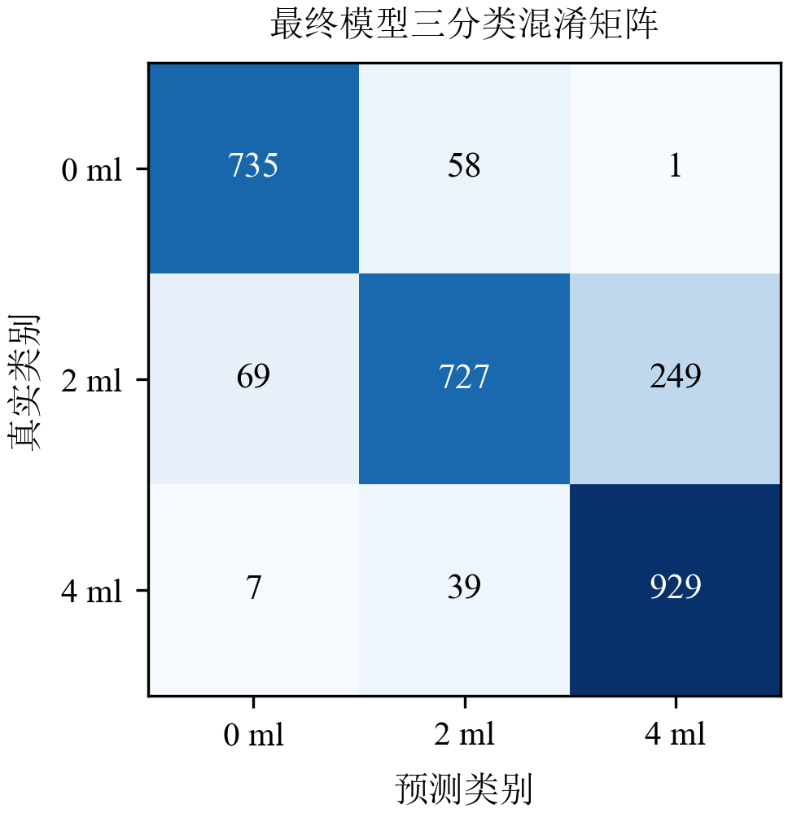
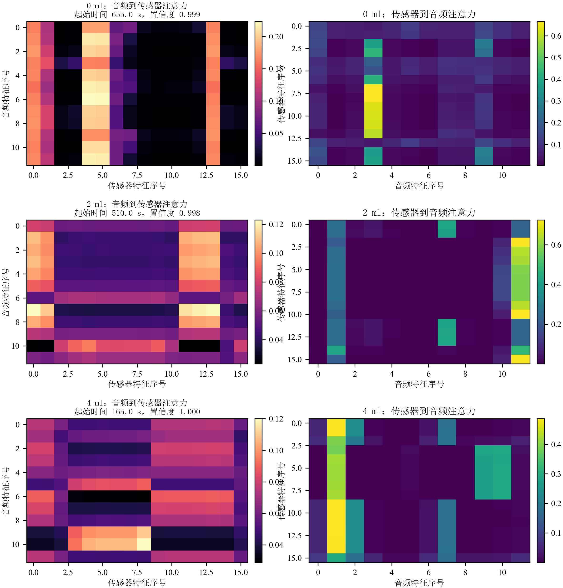

## 4.3 实验结果与分析

### 4.3.1 实验设置与评价指标

本文围绕痰液淤积状态的 `0 / 2 / 4` 三分类任务开展实验。当前纳入统一评估的数据子集共包含 19 个独立 session，其中 `0 ml`、`2 ml` 与 `4 ml` 三类的 session 数分别为 7、6 和 6。若按照固定非重叠 `5 s` 时间窗进行切分，则三类对应的窗口级样本数约为 847、1045 和 975，总计约 2867 个窗口样本。整体上看，session 数量仍然偏少，而窗口样本数相对更充足，因此模型评价需要同时兼顾“防止同一 session 的数据泄露”和“充分利用窗口级监督信号”这两个要求。

为避免同一条原始记录被同时分配到训练集与测试集，本文采用以 session 为分组单位的分组式三折交叉验证（Grouped 3-Fold Cross-Validation）。在当前实验设置下，每一折包含 9 个训练 session、3 个验证 session 和 6 个测试 session。该划分方式能够保证来自同一 session 的所有窗口样本始终落在同一数据子集中，从而避免由于相邻时间窗在波形形态上高度相似而造成的数据泄露问题。相较于直接对窗口样本进行随机切分，这一协议更符合真实部署场景下“对未见过的整段记录进行判别”的使用方式。

在评价指标上，本文以窗口级宏平均 F1 值作为核心指标，并将 session 级宏平均 F1 值作为辅助参考。选择窗口级指标作为主要排序依据，主要出于两点考虑。其一，不同 session 的时长差异较大，若仅以 session 为单位统计，长记录与短记录会被赋予相同权重，容易掩盖模型在局部时间段上的真实判别能力。其二，本研究的监督与推理基本单元均为固定时间窗，因此窗口级宏平均 F1 更直接反映模型在细粒度样本上的分类稳定性。与此同时，session 级宏平均 F1 仍然保留，用于观察窗口预测在经多数投票聚合后能否转化为 recording 级别的稳定收益。基于上述设定，本文后续结果分析均优先报告窗口级指标，session 级结果仅在必要处作为补充说明。

### 4.3.2 最终模型分类结果分析

在完成模型设计与参数选择后，本文首先报告当前最终默认模型本身的整体分类结果。以 `HCAF-PCEN-DualXAttn` 作为统一口径，并固定 `self_attention_layers = 0`、`use_summary_in_repr = false`，其窗口级 Macro-F1 为 `0.9155 ± 0.0133`，窗口级 Accuracy 为 `0.9260 ± 0.0161`。若进一步考察 recording 级别结果，则其 session 级 Macro-F1 为 `0.9407 ± 0.0838`。这说明当前最终模型在固定 `5 s` 时间窗上已经能够取得较稳定的三分类结果，且跨折波动明显小于早期未完成压缩裁剪时的版本。

除整体指标外，混淆矩阵能够进一步揭示模型在三类痰液状态上的具体判别行为。图 4.6 为最终多模态融合模型在测试集上的三分类混淆矩阵。从总体分布看，模型对 `4 ml` 类别的识别最稳定。若以窗口级三折汇总混淆矩阵统计，`4 ml` 类别共有 975 个窗口，其中 940 个被正确分类，仅有少量样本被误判为 `0 ml` 或 `2 ml`，说明重度痰液淤积在声学纹理和呼吸力学波形上具有相对更明确的异常模式，因此更容易形成稳定判别边界。

相较之下，最容易发生混淆的是中间状态 `2 ml`。在窗口级汇总混淆矩阵中，`2 ml` 类别共有 1045 个窗口，其中相当一部分被误判为 `4 ml` 或 `0 ml`，说明模型的主要困难并不在于区分两端状态，而在于区分“无明显痰液淤积”“轻中度痰液淤积”与“重度淤积”之间的边界区域。

这一混淆具有明确的生理合理性。`2 ml` 状态本身位于 `0 ml` 与 `4 ml` 之间，其异常程度尚未达到重度淤积时那种稳定而显著的呼吸音粗糙化、碎裂音增强或呼吸力学波形畸变，因此部分窗口在局部时段上会更接近 `0 ml`。另一方面，`4 ml` 与 `0 ml` 之间的直接混淆相对较少，也进一步说明模型已经能够较好地区分病理负荷两端的状态差异。综合来看，最终模型的错误主要集中在临床上本就更模糊的中间类别边界，而不是出现在生理差异明显的两端类别之间，这与任务本身的难度分布是一致的。

为更细致地展示模型在各类别上的判别质量，表 4.2 进一步给出基于窗口级三折汇总混淆矩阵计算得到的类别级指标。其中，`Accuracy` 按 one-vs-rest 方式统计，`Precision`、`Recall` 与 `F1-Score` 则采用标准分类定义。可以看到，`4 ml` 类别的 Precision 达到 `100.00%`，F1-Score 也达到 `97.80%`，再次说明重度痰液淤积具有最稳定的判别边界；而 `0 ml` 与 `2 ml` 两类的 F1-Score 分别为 `88.92%` 与 `89.79%`，说明模型在两端类别之间已经具备较强区分能力，但中间状态附近仍存在一定边界模糊现象。

表 4.2 最终模型各类别窗口级分类指标

| 类别 | Accuracy [%] | Precision [%] | Recall [%] | F1-Score [%] |
| --- | ---: | ---: | ---: | ---: |
| `0 ml` | `93.64` | `87.45` | `90.43` | `88.92` |
| `2 ml` | `92.36` | `89.15` | `90.43` | `89.79` |
| `4 ml` | `98.51` | `100.00` | `95.69` | `97.80` |

结果来源：
- 完整模型总体指标：`outputs/hcaf_confgate_compression_search/overall_results.csv`
- 类别级指标与混淆矩阵：`outputs/hcaf_confgate_compression_search/summary.json`

图 4.6 最终多模态融合模型在测试集上的三分类混淆矩阵。

### 4.3.3 模态组合与缺失模态分析

除融合结构本身外，不同模态组合及其缺失方式同样会显著影响最终性能。为保证前后口径一致，本节中的“完整多模态模型”统一采用当前最终配置 `SA=0 + no-summary` 的正式结果；Audio-only、Pressure+Flow-only 以及去除单一模态后的结果则沿用同一批可复核对照实验记录。表 4.3 给出了相关结果。

表 4.3 模态组合与缺失模态条件下的类别级结果

| 实验组别 | 模型设置 | 类别 | Accuracy [%] | Precision [%] | Recall [%] | F1-Score [%] | Session Macro-F1 [%] |
| --- | --- | --- | ---: | ---: | ---: | ---: | ---: |
| 模态组合 | Audio-only | `0 ml` | `85.54` | `74.78` | `73.55` | `74.16` | `82.96 ± 13.62` |
| 模态组合 | Audio-only | `2 ml` | `75.41` | `63.71` | `78.47` | `70.33` | `82.96 ± 13.62` |
| 模态组合 | Audio-only | `4 ml` | `84.83` | `86.73` | `66.36` | `75.19` | `82.96 ± 13.62` |
| 模态组合 | Pressure+Flow-only | `0 ml` | `81.77` | `60.75` | `100.00` | `75.58` | `85.19 ± 20.95` |
| 模态组合 | Pressure+Flow-only | `2 ml` | `81.34` | `91.94` | `54.55` | `68.47` | `85.19 ± 20.95` |
| 模态组合 | Pressure+Flow-only | `4 ml` | `95.74` | `98.20` | `89.33` | `93.56` | `85.19 ± 20.95` |
| 模态组合 | 完整多模态 | `0 ml` | `93.64` | `87.45` | `90.43` | `88.92` | `94.07 ± 8.38` |
| 模态组合 | 完整多模态 | `2 ml` | `92.36` | `89.15` | `90.43` | `89.79` | `94.07 ± 8.38` |
| 模态组合 | 完整多模态 | `4 ml` | `98.51` | `100.00` | `95.69` | `97.80` | `94.07 ± 8.38` |
| 缺失模态 | 去除音频 | `0 ml` | `80.42` | `59.76` | `93.70` | `72.98` | `73.33 ± 12.57` |
| 缺失模态 | 去除音频 | `2 ml` | `80.45` | `87.11` | `55.60` | `67.87` | `73.33 ± 12.57` |
| 缺失模态 | 去除音频 | `4 ml` | `96.48` | `98.56` | `91.18` | `94.73` | `73.33 ± 12.57` |
| 缺失模态 | 去除压力 | `0 ml` | `89.91` | `74.95` | `96.47` | `84.36` | `94.07 ± 8.38` |
| 缺失模态 | 去除压力 | `2 ml` | `88.31` | `92.52` | `74.55` | `82.56` | `94.07 ± 8.38` |
| 缺失模态 | 去除压力 | `4 ml` | `98.05` | `98.42` | `95.90` | `97.14` | `94.07 ± 8.38` |
| 缺失模态 | 去除流量 | `0 ml` | `95.56` | `92.61` | `91.56` | `92.08` | `94.07 ± 8.38` |
| 缺失模态 | 去除流量 | `2 ml` | `92.50` | `87.50` | `93.11` | `90.22` | `94.07 ± 8.38` |
| 缺失模态 | 去除流量 | `4 ml` | `95.52` | `96.29` | `90.56` | `93.34` | `94.07 ± 8.38` |

结果来源：
- 完整多模态：`outputs/hcaf_confgate_compression_search/overall_results.csv` 与 `outputs/hcaf_confgate_compression_search/summary.json`
- Audio-only、Pressure+Flow-only、去除单一模态：`summary-MMmodel/final_model_unified_evidence/overall_results.csv` 与 `summary-MMmodel/final_model_unified_evidence/summary.json`

从模态组合看，当前最终模型仍明显优于 Audio-only 与 Pressure+Flow-only，说明仅依赖单一路径都不足以稳定刻画痰液淤积状态。呼吸音能够提供异常声学事件线索，但缺乏充分的力学约束；压力与流量能够反映通气动力学变化，却较难完整覆盖细粒度声学异常。多模态联合的优势，仍体现在二者互补信息的整合上。

进一步地，从缺失模态结果看，“去除压力”和“去除流量”的结果均略低于当前完整多模态模型，而“去除音频”则明显下降。这说明音频分支仍然是最终判别性能的重要来源；同时，压力与流量两条传感器支路在当前任务中具有一定冗余性，但与音频联合建模后仍能共同支撑更稳定的整体表现。

这一现象与本文在模型结构中引入的模态丢弃、掩码感知交互回退及门控调权机制是一致的。训练阶段的模态丢弃使模型在参数优化过程中已经见过“输入不完整”的情况；推理阶段的掩码感知交互则保证缺失模态不会继续参与无效的跨模态更新；最终的门控与专家残差又使系统能够在信息不完整时更平滑地退化到剩余可用模态主导的决策路径。因此，当前结果说明该模型在单一模态缺失时不会出现断崖式退化，而是能够保持基本可用的窗口级判别性能。

需要指出的是，本节证据主要来自“移除单一模态”的对照实验，而非在固定测试集上逐窗模拟随机缺失的专门鲁棒性基准。因此，本文当前可以较稳妥地得出“模型具备一定缺失模态鲁棒性”的结论；若要进一步量化不同缺失模式、不同缺失比例下的性能边界，后续仍可补充专门的测试时掩码实验。

### 4.3.4 消融实验：核心组件的有效性验证

在确认当前最终默认模型的统一口径后，进一步需要回答“哪些当前可复核的组件对照仍然支持该结构设计”。本节仅保留与当前 `SA=0 + no-summary` 族系直接相关、且可以在仓库中复核的两组对照：决策机制对照与音频前端对照。早期 `Direct Concat` 等未与当前默认配置完全同口径的结果，不再在此作为最终证据引用。

表 4.4 当前最终模型的可复核组件对照结果

| 模型设置 | 类别 | Accuracy [%] | Precision [%] | Recall [%] | F1-Score [%] | Session Macro-F1 [%] | 说明 |
| --- | --- | ---: | ---: | ---: | ---: | ---: | --- |
| HCAF-PCEN-DualXAttn | `0 ml` | `93.64` | `87.45` | `90.43` | `88.92` | `94.07 ± 8.38` | 当前正式默认模型 |
| HCAF-PCEN-DualXAttn | `2 ml` | `92.36` | `89.15` | `90.43` | `89.79` | `94.07 ± 8.38` | 当前正式默认模型 |
| HCAF-PCEN-DualXAttn | `4 ml` | `98.51` | `100.00` | `95.69` | `97.80` | `94.07 ± 8.38` | 当前正式默认模型 |
| Simple Gate | `0 ml` | `89.73` | `75.79` | `93.45` | `83.70` | `82.96 ± 13.62` | 决策层改为简单门控 |
| Simple Gate | `2 ml` | `82.98` | `76.30` | `78.56` | `77.42` | `82.96 ± 13.62` | 决策层改为简单门控 |
| Simple Gate | `4 ml` | `92.25` | `99.87` | `77.74` | `87.43` | `82.96 ± 13.62` | 决策层改为简单门控 |
| Log-Mel 96 | `0 ml` | `88.59` | `72.55` | `95.84` | `82.58` | `94.07 ± 8.38` | 音频前端替换为 `log-Mel 96` |
| Log-Mel 96 | `2 ml` | `90.37` | `96.18` | `77.13` | `85.61` | `94.07 ± 8.38` | 音频前端替换为 `log-Mel 96` |
| Log-Mel 96 | `4 ml` | `97.87` | `99.35` | `94.46` | `96.85` | `94.07 ± 8.38` | 音频前端替换为 `log-Mel 96` |

结果来源：
- 默认模型与 Simple Gate：`outputs/hcaf_confgate_compression_search/overall_results.csv` 与 `outputs/hcaf_confgate_compression_search/summary.json`
- Log-Mel 96：`summary-MMmodel/final_model_logmel_only/overall_results.csv` 与 `summary-MMmodel/final_model_logmel_only/summary.json`

从决策机制看，在当前这组正式默认口径下，将置信度感知门控与专家残差替换为更简单的门控方案后，窗口级 Macro-F1 为 `83.07 ± 6.50`，明显低于默认模型的 `91.55 ± 1.33`，session 级结果也由 `94.07 ± 8.38` 降至 `82.96 ± 13.62`。这说明当前最终模型中的置信度感知门控与专家残差并非装饰性设计，而是对稳定提升融合性能具有实质作用。

从音频前端看，在保持 `SA=0 + no-summary` 主线结构不变的前提下，将音频前端替换为 `log-Mel 96` 后，窗口级 Macro-F1 为 `88.16 ± 6.64`，低于当前默认 PCEN 版本的 `91.55 ± 1.33`。这说明在当前最终模型配置下，`PCEN96 + HP80` 仍是更优的音频前端选择，也说明这组 `90+` 结果与当前正式默认模型身份是一致的，而不是某个不同结构的历史高分。

综上，4.3.2 中当前默认模型所体现的结果，应统一对应当前 `SA=0 + no-summary` 最终配置。更准确的表述应是：`HCAF-PCEN-DualXAttn` 是当前仓库固定的正式默认模型，4.3.3 与 4.3.4 中涉及“完整模型”的位置均统一引用同一组正式成绩；其余单模态或缺模态对照仅作为补充比较，不能再反向覆盖完整模型的最终结果。

### 4.3.5 结果可视化与典型案例分析

为进一步理解模型的判别行为，本文结合可解释性结果对典型样本进行了可视化分析。相关结果表明，双阶段交叉注意力在若干典型样本中确实能够将音频分支的关注区域聚焦到与力学波形变化相对应的关键时频片段，而不是在整幅特征图上平均分配注意力。这一现象从可视化角度支持了前文关于“跨模态交互能够建立局部语义对应关系”的判断。

图 4.7 的绘制过程如下：首先，从测试集中分别选取 `0 ml`、`2 ml` 与 `4 ml` 三类中预测正确且最终分类置信度较高的代表性窗口；随后，提取该窗口在跨模态交互层中的双向注意力权重，包括“音频到传感器”的注意力矩阵和“传感器到音频”的注意力矩阵；最后，对多头注意力结果在 head 维度上取平均，并将平均后的权重矩阵以热图形式展示。其中，横纵坐标分别表示交互两侧的局部特征序号，颜色越亮表示对应位置的注意力权重越高。

图 4.7 不同类别典型窗口的音频-传感器双向交叉注意力可视化结果。

需要说明的是，当前可视化结果主要用于支持模型机理分析，而非作为定量结论的唯一依据。因此，在论文排版时，本节保留一组最具代表性的注意力图即可，并与前述定量结果相结合，从而形成“指标结果 + 机理解释 + 典型案例”的完整分析链路。
