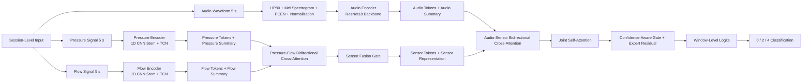
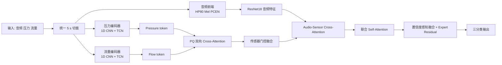

# 硕士论文模型结构图草稿

本文当前主模型为 `hcaf_audio_r18img_pq_xattn_5s`。下图使用 `Mermaid` 描述整体数据流，适合在 Markdown 中快速预览和持续修改。

## 1. Overall Architecture

## 2. Compact Chinese Version

## 3. Notes

- 如果你的 Markdown 预览器支持 `Mermaid`，可以直接渲染。
- 如果后面要投稿或放进论文终稿，建议再转成 `TikZ`、`draw.io` 或导出为矢量图。
- 如果你希望，我下一步可以继续把这张图改成“带张量尺寸”的版本，例如标出 `[B,1,96,501]`、`[B,N,D]` 等。
